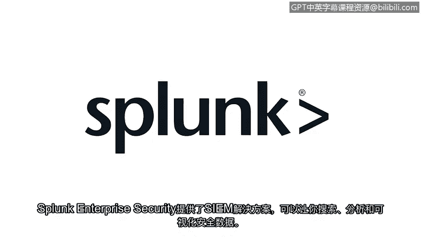

**网络安全基础：第六课：重新审视SIEM工具 🛠️**

在本节课中，我们将学习安全信息与事件管理工具的核心概念与工作流程。SIEM工具是安全分析师进行日常监控、告警分析和事件调查的关键平台。

作为安全分析师，你需要能够快速访问履行职责所需的相关数据。无论是处理告警、监控系统，还是在事件调查中分析日志数据，SIEM都是完成这项工作的工具。

简单回顾一下，SIEM是一个通过收集和分析日志数据来监控组织关键活动的应用程序。它通过从多个来源收集、分析和报告安全数据来实现这一功能。

之前，你已经了解了SIEM进行数据收集的过程。现在，让我们重新审视这个过程。

**SIEM数据处理流程**

以下是SIEM工具处理数据以使其可用的三个主要步骤：

1.  **收集**：SIEM工具首先从环境中各处的设备和系统收集并处理海量数据。
2.  **规范化**：原始数据经过处理，被格式化为一致的样式，并且只包含相关的事件信息。其核心目的是解决数据格式不统一的问题，公式可表示为：`规范化数据 = 统一格式(原始多格式数据)`
3.  **索引**：最后，SIEM工具为数据建立索引，以便通过搜索进行访问。

完成这些步骤后，所有不同来源的所有事件都可以通过你的指尖轻松访问。这非常有用，SIEM工具让安全分析师能够轻松快速地访问和分析环境中网络上的数据流。

在实际工作中，你可能会遇到不同的SIEM工具。重要的是，你能够调整并适应你所在组织最终使用的任何工具。

考虑到这一点，让我们来探索一些当前安全行业中常用的SIEM工具。

**主流SIEM工具简介**

以下是几个常见的SIEM平台及其基本工作方式：

*   **Splunk**：Splunk是一个数据分析平台。其企业安全版本提供SIEM解决方案，允许你搜索、分析和可视化安全数据。其流程可概括为：`收集数据 -> 处理并存储到索引 -> 通过搜索等方式访问`。
*   **Chronicle**：Chronicle是谷歌云的SIEM解决方案，用于存储安全数据以进行搜索、分析和可视化。其工作流程是：`数据转发至Chronicle -> 数据被规范化或清理 -> 数据被处理并建立索引 -> 通过搜索栏访问可用数据`。

上一节我们介绍了SIEM工具的基本原理和常见平台，本节中我们来看看如何在这些平台上进行有效搜索。接下来，我们将探索如何在这些SIEM平台上进行搜索。

**总结**

本节课中，我们一起学习了SIEM工具的核心价值与数据处理流程。我们了解到SIEM通过**收集、规范化和索引**三个步骤，将原始的、格式各异的海量日志数据转化为安全分析师可快速搜索和分析的统一格式。我们还简要认识了Splunk和Chronicle这两个主流SIEM平台的基本架构。掌握这些基础知识是有效使用任何SIEM工具进行安全监控与分析的前提。