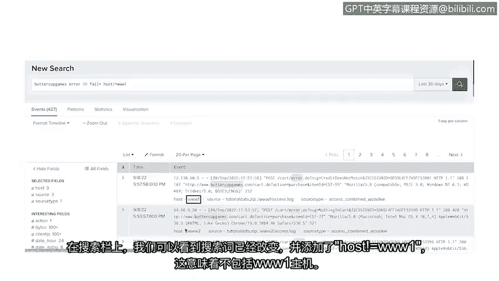

# 043：使用Splunk查询事件 🔍

在本节课中，我们将要学习如何在安全信息和事件管理（SIEM）系统中进行搜索和查询，特别是使用Splunk的搜索处理语言（SPL）来定位和分析安全事件。我们将了解如何构建有效的查询以快速获取所需数据。

## 概述：SIEM中的搜索挑战

上一节我们介绍了SIEM的工作原理，本节中我们来看看如何搜索和查询已导入SIEM数据库的事件。通过向SIEM的搜索引擎输入查询，可以访问这些数据。

SIEM数据库中可以存储海量数据，其中一些数据可能追溯到多年前。这使得搜索特定安全事件变得具有挑战性。

## 构建有效的查询

例如，假设您要搜索一个失败的登录事件。您使用关键词“failed login”进行搜索。这是一个非常宽泛的查询，可能会返回数千条结果。像这样宽泛的搜索查询会降低搜索引擎的响应速度，因为它需要在所有索引数据中进行搜索。

但是，如果您指定额外的参数，例如事件ID以及日期和时间范围，就可以缩小搜索范围以获得更快的结果。确保搜索查询具有针对性非常重要，这样您才能准确找到所需内容，并节省搜索过程的时间。

## Splunk搜索处理语言（SPL）

不同的SIEM工具使用不同的搜索方法。例如，Splunk使用其专有的查询语言，称为搜索处理语言，简称SPL。

SPL提供许多不同的搜索选项，可用于优化搜索结果，从而获取您正在寻找的数据。

## 执行原始日志搜索

现在，我将演示在Splunk Cloud中为一个名为Buttercup Games的虚构在线商店，执行一次针对引用错误或失败事件的原始日志搜索。

首先，我们使用搜索栏输入查询：`Buttercup Games error OR fail*`。

这个搜索指定了索引为“Buttercup Games”。我们还指定了搜索词“error”或“fail”。布尔运算符“OR”确保两个关键词都会被搜索。

术语“fail*”末尾的星号被称为通配符。这意味着它将搜索所有包含“fail”的可能结尾。这有助于我们扩展搜索结果，因为事件可能以不同方式标记失败。例如，有些事件可能使用术语“failed”。

## 优化搜索范围

接下来，我们使用时间范围选择器选择一个时间范围。请记住，我们的搜索越具体越好。让我们搜索过去30天的数据。

在搜索栏下方，是我们的搜索结果。有一个时间线，以可视化形式展示了一段时间内的事件数量。这有助于识别事件模式，例如活动高峰。

在时间线下方是事件查看器，它列出了与我们搜索匹配的事件列表。请注意，我们的搜索词“Buttercup Games”和“error”在每个事件中都被高亮显示。看起来没有找到任何与“fail”一词匹配的事件。

## 分析搜索结果

每个事件都带有时间戳和包含错误的原始日志数据。似乎存在与Buttercup Games网站中使用的HTTP Cookie相关的错误。

在原始日志数据的底部，有一些与数据源相关的信息，包括主机名、源和源类型。这些信息告诉我们事件数据源自何处，例如某个设备或文件。

## 精炼搜索结果

如果我们点击它，可以选择将其从搜索结果中排除。

在搜索栏上，我们可以检查到搜索词已被更改，并添加了“host!=www1”，这意味着不包含www1主机。请注意，新的搜索结果不包含www1作为主机，但包含www2和www3。

这只是您可以用来定位搜索以检索所需信息的众多方法之一。这种搜索被称为原始日志搜索，由于它在搜索过程中提取日志数据字段，因此搜索性能较慢。

## 总结与展望

作为一名安全分析师，您将使用不同的命令来优化搜索性能，以获得更快的搜索结果。

至此，关于Splunk的查询就完成了。您已经了解了有效查询的重要性以及如何执行基本的Splunk搜索。

接下来，您将学习如何在Chronicle中查询事件。

本节课中我们一起学习了如何在Splunk中构建和执行查询，通过使用特定的索引、关键词、布尔运算符、通配符和时间范围来精炼搜索，从而高效地从海量安全事件数据中定位所需信息。掌握这些技能对于快速进行安全事件检测和响应至关重要。