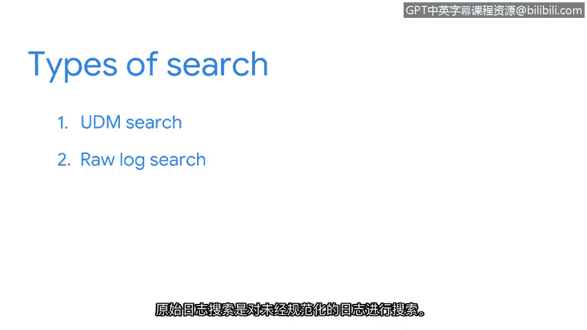
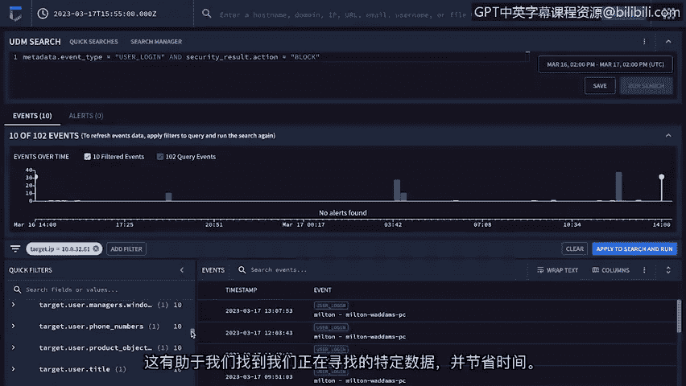

# 044：使用Chronicle查询事件 🔍

在本节中，我们将学习如何使用Chronicle平台来搜索和筛选日志数据。Chronicle是一个强大的工具，它允许安全分析师通过查询来检测潜在的安全事件。我们将重点介绍其搜索功能，特别是如何使用统一数据模型（UDM）搜索和原始日志搜索来定位特定事件。

## 概述：Chronicle的搜索功能

Chronicle允许你搜索和筛选日志数据。它使用名为YARA-L的计算机语言来定义检测规则，这些规则用于在已摄入的日志数据中进行搜索。例如，你可以使用YARA-L编写规则来检测与窃取有价值数据相关的特定活动。

通过Chronicle的搜索字段，你可以根据主机名、域名、IP地址、URL、电子邮件、用户名或文件哈希等字段进行查询。

## 搜索方法：UDM搜索与原始日志搜索

使用搜索字段时，你可以输入不同类型的搜索。默认的搜索方法是**UDM搜索**，它代表统一数据模型。这种搜索会遍历经过**规范化**的数据。

如果你在规范化数据中找不到所需信息，可以选择搜索**原始日志**。原始日志搜索会遍历那些尚未被规范化的日志。

从我们之前关于SIEM流程的讨论中，你可能还记得，原始日志会在规范化步骤中被处理。在规范化过程中，原始日志中的所有相关信息会被提取并格式化，使数据更易于搜索。我们可能需要搜索原始日志的原因包括：查找可能未包含在规范化日志中的数据（例如某些未被规范化的特定字段），或者排查数据摄入问题。

## 实践：执行一次UDM搜索

现在，让我们来检查一个使用Chronicle进行的、针对登录失败的UDM搜索示例。

首先，点击结构化查询构建器图标，以便执行UDM搜索。我将输入以下搜索内容：
`metadata.event_type = “USER_LOGIN” AND security_result.action = “BLOCK”`

让我们分解一下这个UDM搜索。由于我们正在搜索规范化数据，因此需要指定一个使用UDM格式的搜索。UDM事件具有一组通用字段。

*   **`metadata.event_type`** 字段详细说明了事件类型。在这里，我们要求Chronicle查找一个认证活动事件，即“用户登录”。
*   **`AND`** 是一个逻辑运算符，它告诉搜索引擎要同时包含这两个条件。
*   **`security_result.action`** 字段指定了一个安全操作，例如“允许”或“阻止”。在这里，操作是“阻止”。这意味着用户登录被阻止或失败了。

现在，我们按下查询按钮。我们将专注于搜索规范化数据。

## 解读搜索结果

屏幕上会呈现搜索结果。这里有很多信息。

在“UDM搜索”下，我们可以看到我们的搜索词。还有一个条形图时间线，可视化显示了一段时间内的失败登录事件。快速浏览一下，这能让我们了解失败登录活动随时间的变化情况，帮助我们发现可能的模式。

在时间线下方，有一个与此搜索关联的、带时间戳的事件列表。在每个事件下，都有一个“资产”，即设备名称。例如，这个事件显示了一个名为“Alice”的用户的登录失败记录。

如果我们点击该事件，可以打开与该事件关联的原始日志。在调查过程中，我们可以解读这些原始日志，以获取有关事件活动的更多细节。

## 使用快速筛选器

在左侧，有“快速筛选器”。这些是我们可以用来筛选搜索结果的其他字段或值。例如，如果我们点击 `target.ip`，会得到一个IP地址列表。如果我们点击其中一个IP地址，就可以将搜索结果筛选为仅包含此目标IP地址的事件。这帮助我们找到正在寻找的特定数据，并在此过程中节省时间。

## 总结

干得漂亮。现在，你知道了如何使用Chronicle执行搜索。在接下来的实践活动中，你将有机会使用我们刚刚讨论过的SIEM工具来执行搜索。😊