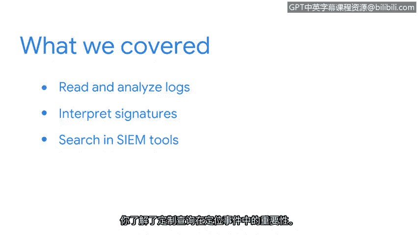

# 045：总结

在本节课中，我们将回顾并总结《拉响警报：检测与响应》这一章节的核心学习内容。我们重点探讨了日志分析、入侵检测系统以及安全信息与事件管理工具的使用。

## 章节回顾

上一节我们介绍了在SIEM工具中进行高级搜索的技巧，本节中我们来整体回顾本模块的知识体系。

你学习了如何阅读和分析日志。
你研究了日志文件的生成方式及其在分析中的应用。
你还比较了不同类型的常见日志格式，并学会了如何解读它们。

通过对比基于网络的系统和基于主机的系统，你深化了对入侵检测系统的理解。
你还学会了如何解读特征码。你研究了特征码的编写方式，以及它们如何检测、记录和告警入侵行为。
你在命令行中与Suricata交互，以检查和解读特征码及警报。
最后，你学习了如何在Splunk和Chronicle等SIEM工具中进行搜索。
你了解了构建针对性查询以定位安全事件的重要性。

## 核心技能与价值

在事件响应的最前沿，监控和分析网络流量以寻找入侵指标是主要目标之一。
作为一名安全分析师，你将运用以下所有技能：执行深入的日志分析、了解如何阅读和编写特征码，以及如何访问日志数据。

## 总结

本节课中我们一起学习了网络安全检测与响应的基础。从日志分析到入侵检测，再到使用SIEM工具进行高效查询，这些技能构成了主动防御和安全监控的基石。掌握这些内容，为你后续应对真实安全事件打下了坚实的基础。