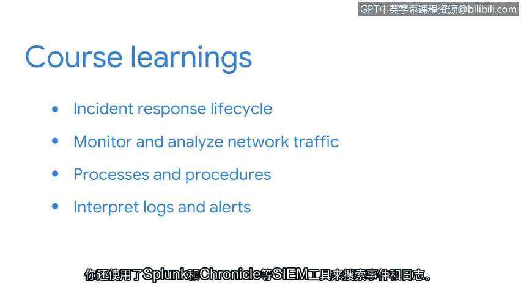

# 046：课程总结

在本节课中，我们将回顾《拉响警报：检测与响应》课程的核心内容。我们一起学习了事件响应生命周期、网络流量分析、日志解读以及安全分析师日常使用的关键工具。

## 课程回顾

上一节我们介绍了各种安全工具的使用，本节中我们来整体回顾本课程的知识体系。

以下是本课程涵盖的主要模块：

*   **事件响应生命周期概述**：学习了安全团队如何协调响应工作，并探索了事件响应中使用的文档、检测和管理工具。
*   **网络流量监控与分析**：学习了使用数据包嗅探器捕获和分析数据包。练习了使用如 **`tcpdump`** 等工具捕获和分析网络数据，以识别入侵指标。
*   **事件响应流程与程序**：探索了事件响应生命周期各阶段涉及的流程与程序。学习了与事件检测和分析相关的技术。了解了如监管链、行动手册和最终报告等文档。课程最后探讨了用于恢复和事后活动的策略。
*   **日志与警报解读**：探索了在命令行中使用 **`Suricata`** 来阅读和理解签名与规则。使用了如 **`Splunk`** 和 **`Chronicle`** 等SIEM工具来搜索事件和日志。

## 总结与展望

本节课中我们一起学习了事件检测与响应的核心流程和实用工具。作为安全分析师，每天都会面临新的挑战，无论是调查证据还是记录工作，你都可以运用在本课程中学到的知识来有效地响应事件。

安全领域最吸引人的一点在于总有新知识需要学习。在接下来的学习中，你将开始探索一种名为 **`Python`** 的编程语言，它可以用于自动化安全任务。

请继续保持出色的学习状态。