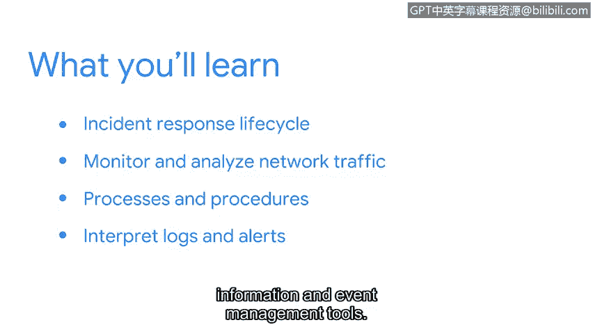

# 047：课程介绍 🚨

在本节课中，我们将学习网络安全事件检测与响应的核心概念，了解安全分析师在应对安全事件中的职责，并预览本课程将涵盖的主要技能与工具。

---

安全攻击正在增加，新的漏洞每周都会被利用和发现。

无论一个组织对安全攻击的准备多么充分，在某些时候，总会出现问题。无论是数据泄露、勒索软件，还是员工犯下的简单错误，安全事件总会发生。

而有效响应这些安全事件，正是像您这样的安全专业人士的职责。

大家好，欢迎来到本课程。我是Dave，是Google Cloud的首席安全战略师。我拥有20年作为安全从业者和领导者的经验。在过去的八年里，我曾在Fortinet、Splunk和Google等行业领先的安全供应商工作，并在此过程中专攻安全分析领域。

我热衷于帮助分析师们掌握在其职业生涯中取得成功所必需的技能。非常高兴您能来到这里。到目前为止，您已经做得非常出色，学习了许多关于安全概念、最佳实践和安全攻击类型的知识。

现在，在本课程中，我们将重点关注事件的检测、分析与响应。

您将有机会使用诸如 **`TCPdump`**、**`Wireshark`**、**`Suricata`**、**`Splunk`** 和 **`Chronicle`** 等工具来应用所学知识。在本课程结束时，您将对事件响应有深入的理解。

首先，您将学习事件响应生命周期以及事件响应团队如何协同工作。

您还将了解检测和响应中使用的工具类型，包括文档工具。您还将获得自己的事件处理者日志，用于在调查过程中记录信息。

接下来，您将应用您在网络和Linux方面的知识，使用像 **`Wireshark`** 和 **`TCPdump`** 这样的数据包嗅探器来监控和分析网络流量，捕获并分析数据包以寻找潜在的安全事件迹象。

然后，您将熟悉事件检测和响应过程中常用的流程与程序。

您将学习如何使用调查工具分析和验证事件，并生成相关文档。

最后，您将学习如何解读日志和警报。

您将了解检测工具如何生成日志，以及这些日志如何在安全信息与事件管理工具中被分析。

---

准备好了吗？让我们开始吧。

---

在本节课中，我们一起学习了网络安全事件的普遍性、安全分析师的核心职责，以及本课程将引导我们掌握的从事件生命周期理解到具体工具实操的完整知识体系。接下来，我们将深入探讨事件响应的具体阶段。