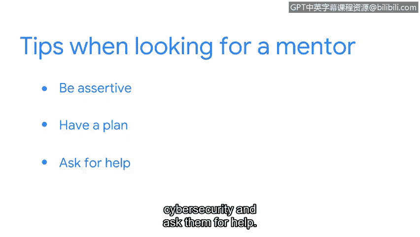

# 048：1_04 导师助力你的网络安全职业发展

在本节课中，我们将跟随谷歌云的首席安全战略师Dave，了解他如何从一名普通大学生成长为网络安全专家，并学习如何通过导师的帮助来规划和发展自己的网络安全职业生涯。

我的名字是Dave。我是谷歌云的首席安全战略师。

我的工作是直接与安全从业者合作，帮助他们保护其所在组织。

我热爱这份工作的多样性。某一天我可能在为客户排查技术问题。

第二天我可能在为某个特定问题编写代码解决方案。每天都有新事物。

我从不感到厌倦。我是在美国中西部长大的孩子。

我上大学学习工程学。我曾以为我喜欢，但我意识到我并不真正热爱工程学。

但我爱上了计算机科学，而我当时甚至不知道这是一个可选专业。

大学早期，我最终找到了一份帮助台人员的工作。

但后来我得到了一份系统管理员的工作。我发现自己在一家支付行业的初创公司工作。

我的工作从一名普通的IT人员转变为一名网络安全人员。

我在那个职位上工作了七年，从一人安全团队到后期管理一个中等规模的安全组织，什么都做过。

之后我转到了桌子的另一边，开始为安全供应商工作。

这给了我机会亲眼目睹数百家其他组织如何运行他们的安全项目，这确实令人大开眼界。网络安全的有趣之处在于，你真的可以将全部人生经验带入网络安全领域。

你所做的是试图保护一个组织，不一定是为了防止意外。

而是保护组织免受另一端的、试图伤害你组织的人的侵害。

越来越清楚的一点是，拥有不同背景和经历的人通常能为我们应对威胁的方式带来巨大改进。

我强烈建议参与安全组织。

这是一个结识其他能在你职业道路上提供帮助的人的地方。

我认为人们会惊讶地发现，在我们这个行业可以获得多少帮助。

有许多更资深、更有成就的人愿意成为导师。我认为，作为寻找导师的人，你能做的最好的事情就是积极主动并制定计划。

所以，要事先想好几件你想努力提升的事情。

然后联系某个在网络安全特定领域工作的人。

向他们寻求帮助。我想你会惊讶于人们是多么乐于助人。

本节课中我们一起学习了Dave的职业发展路径，了解了网络安全工作的多样性和挑战性，并掌握了寻求导师帮助、规划职业发展的关键方法：**积极主动、明确目标、主动联系**。记住，网络安全领域乐于助人，大胆迈出寻求指导的第一步是职业成长的重要环节。