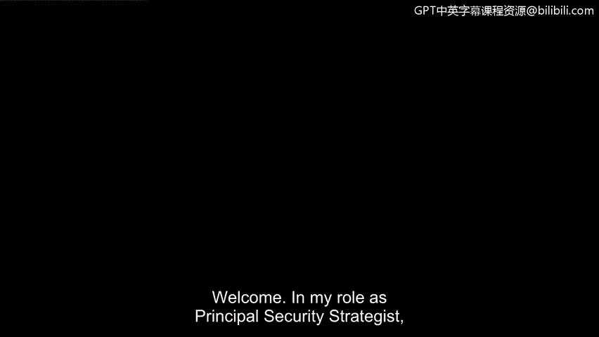
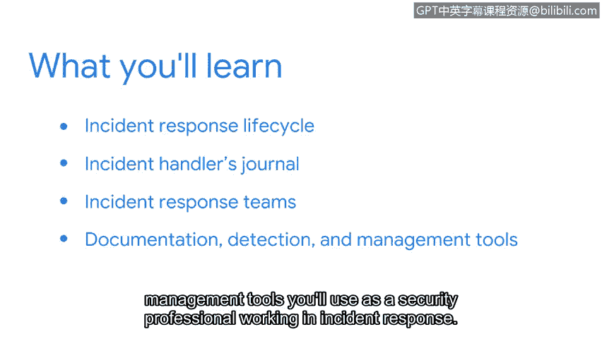

**谷歌网络安全专业证书第六课：1：欢迎来到第一周** 🚀

在本节课中，我们将开始学习《检测与响应》模块。我们将回顾NIST网络安全框架，重点关注事件响应生命周期，并介绍事件响应团队的角色与工具。

---

欢迎。在我的首席安全策略师角色中，我见证了本课程将教授的事件响应操作如何在组织中实施。

检测和响应事件最令人兴奋的一点，是运用数据来理解攻击者在组织环境中行为的挑战。

没有两次调查是完全相同的。但随着分析技能的磨练，你可以学会识别特定的行为模式。

---

上一阶段，我们建立了对资产安全、威胁和漏洞的扎实理解。我们探讨了将NIST网络安全框架作为风险管理的方法论。我们学习了通过资产分类与保护来降低组织风险，并探索了保护数据的安全与隐私控制措施。我们使用了如MITRE和CVE等工具来调查常见漏洞，并运用威胁建模等技术来培养攻击者思维。

接下来，我们将重新审视NIST网络安全框架，重点关注**事件响应生命周期**。你将获得自己的**事件处理者日志**，并将在后续课程中持续使用它。

我们还将介绍事件响应团队，包括不同的团队角色以及他们如何组织起来响应事件。

最后，你将了解作为一名从事事件响应工作的安全专业人员，将使用的各种文档、检测和管理工具类型。

---

在后续课程中，你将有机会使用这些工具。

你准备好开始检测与响应的旅程了吗？让我们开始吧。

---

---

**总结**：本节课我们一起开启了《检测与响应》模块的学习，概述了本模块的核心内容：重温NIST框架的事件响应部分、使用事件处理者日志、认识事件响应团队以及了解相关工具。这为后续深入实践打下了基础。