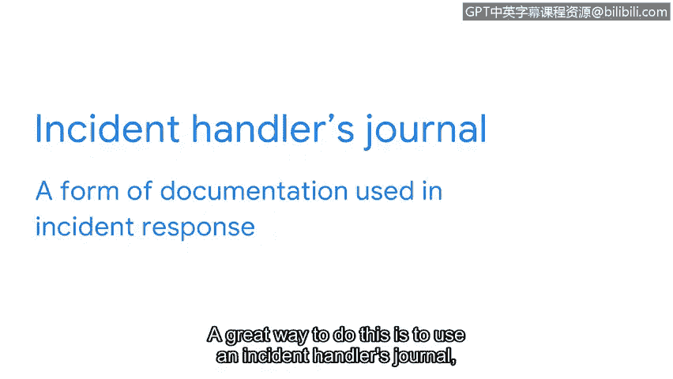

# 050：事件响应生命周期简介

在本节课中，我们将学习事件响应生命周期框架，理解安全事件与一般事件的区别，并了解如何记录事件调查的关键信息。

## 概述：事件响应框架的重要性

事件生命周期框架为支持事件响应操作提供了结构。框架帮助组织为其事件响应流程开发标准化的方法，以便以有效且一致的方式管理事件。组织可以根据自身需求采用和修改多种不同类型的框架。在本课程中，我们将重点介绍NIST网络安全框架（CSF），然后对其进行扩展，并讨论NIST事件响应生命周期的各个阶段。

## NIST网络安全框架（CSF）回顾

回顾一下，NIST CSF的五个核心功能是：识别、保护、检测、响应和恢复。本课程将探讨该框架的最后三个步骤：检测、响应和恢复。这三个步骤是事件响应过程中的关键阶段。作为一名分析师，你将检测和响应事件，并实施恢复行动。

## NIST事件响应生命周期

NIST事件响应生命周期是另一个专门用于事件响应的NIST框架，它包含额外的子步骤。它始于准备阶段，接着是检测与分析，然后是遏制、根除和恢复，最后是事后活动。

需要指出的一点是，事件生命周期不是一个线性过程，而是一个循环。这意味着随着新发现的产生，步骤可能会重叠。这个生命周期为我们如何有效响应事件提供了一个蓝图。

## 理解安全事件

但在我们深入探讨事件检测与响应之前，让我们花些时间来理解什么是事件。根据NIST的定义，事件是指实际上或即将在未经合法授权的情况下，危及信息或信息系统的机密性、完整性或可用性的发生，或构成对法律、安全策略、安全程序或可接受使用策略的违反或即将发生的威胁。

这包含了很多信息，让我们来分解一下。理解所有安全事件都是事件，但并非所有事件都是安全事件，这一点很重要。

### 什么是事件？

事件是网络、系统或设备上可观察到的发生。以下是一个事件的例子：用户尝试登录其电子邮件账户，但因为忘记密码而无法登录。用户随后请求重置密码并成功更改了密码。这是一个可观察到的事件。为什么？因为系统和应用程序会记录密码重置请求，日志提供了某事发生的证据。我们知道有人成功请求了密码重置，并且他们没有违反安全策略来访问账户。

现在，想象一下，如果不是账户的合法所有者，而是一个恶意行为者试图访问账户，并成功发起了密码更改请求，更改了账户密码。这将被视为一个事件，同时也是一个安全事件。它是一个事件，因为它是可观察到的发生。它也是一个安全事件，因为恶意行为者违反了安全策略，非法访问了一个本不属于他们的账户。

记住，所有安全事件都是事件，但并非所有事件都是安全事件。

## 事件调查与记录

就像侦探处理案件时仔细处理和记录证据与发现一样，安全分析师在调查安全事件时也需要这样做。事件调查揭示了关于事件“五个W”的关键信息：谁触发了事件、发生了什么、事件何时发生、事件在何处发生，以及事件为何发生。

跟踪这些信息至关重要，不仅在事件调查期间，而且在调查结束撰写最终报告时也是如此。作为一名分析师，你需要一种方法来记录和引用这些信息，以便在需要时轻松访问。一个很好的方法是使用事件处理者日志，这是事件响应中使用的一种文档形式。

在本课程中，你将使用自己的事件处理者日志来记录任何事件细节。我们将在接下来的课程中进一步讨论文档记录。

## 总结

本节课中，我们一起学习了事件响应生命周期框架，区分了安全事件与一般事件，并了解了使用事件处理者日志记录关键调查信息的重要性。这些是构建有效事件响应能力的基础。