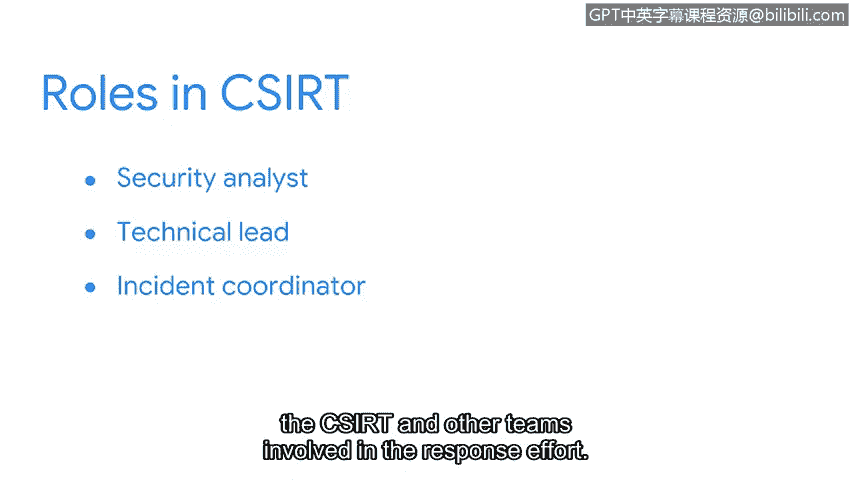

# 051：事件响应团队

在本节中，我们将讨论事件响应团队如何管理安全事件。

你可能曾经是某个团队的一员，无论是体育团队、工作团队还是学校团队。当每个人都运用其多样化的优势为一个共同目标努力时，团队最有可能成功。

事件响应团队也不例外。成功应对安全事件并非孤立发生，它需要一个由安全与非安全专业人员组成的团队，各司其职，共同协作。

计算机安全事件响应团队（CSIRT）是一组专门从事事件管理与响应的安全专业人员。CSIRT的目标是有效且高效地管理事件，为响应和恢复提供服务与资源，并防止未来事件发生。

安全是共同的责任，因此CSIRT必须与其他部门跨职能合作，共享相关信息。例如，如果一个事件导致敏感数据（如财务文件或个人身份信息）泄露，那么必须咨询法律团队。某些法规遵从性措施可能要求组织在特定时间范围内公开披露安全事件。这意味着CSIRT必须与组织的公共关系团队协作，协调公开披露工作。

那么CSIRT具体如何运作？首先是安全分析师。分析师的工作是调查安全警报，以确定是否发生了事件。如果检测到事件，分析师将确定事件的严重性等级。一些事件可以由安全分析师轻松补救，无需升级。但如果事件高度严重，则会升级给技术负责人，技术负责人通过指导安全事件完成其生命周期来提供技术领导。

在此期间，事件协调员跟踪和管理CSIRT及其他参与响应工作的团队的活动。他们的职责是确保遵循事件响应流程，并定期向团队更新事件状态。

并非所有CSIRT都相同。根据组织的不同，CSIRT也可以被称为事件处理团队（IHT）或安全事件响应团队（SIRT）。

根据组织的结构，一些团队可能具有更广泛或更专业的侧重点。例如，一些团队可能专门负责危机管理，而另一些团队可能与安全运营中心（SOC）整合。

角色也可能有不同的名称。例如，技术负责人也可以被称为运营负责人。无论团队的名称或侧重点如何，它们都拥有共同的目标：事件管理与响应。

现在你已经对事件响应团队有了一些了解，我们将继续学习事件响应团队如何计划、组织和响应事件。我们将在下一个视频中再见。

