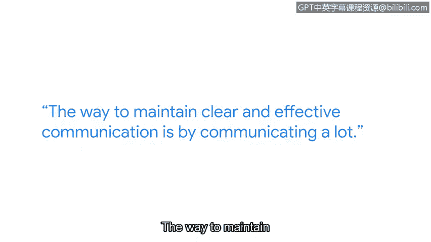

# 052：事件响应中的沟通艺术

在本节课中，我们将学习事件响应过程中沟通的重要性。我们将了解一个高效团队如何通过清晰、持续的沟通来协同工作，以应对网络安全威胁。

---

上一节我们介绍了事件响应的基本概念，本节中我们来看看沟通在其中扮演的关键角色。

我的名字是法蒂玛，我是谷歌检测与响应团队的技术主管经理。如果网络中存在黑客，我们的工作就是找到他们。

从事检测工作就像一位艺术家为演出做准备。我们花费大量时间开发各种特征签名来检测黑客。然后有一天，演出时刻到了。你会感受到同样的紧张感，并质疑自己是否已为演出做好准备。但你其实别无选择。黑客总会到来，你必须为他们做好准备。

我认为网络安全非常令人兴奋。你永远不知道下一个漏洞何时会被公开，也永远不知道下一次事件何时会发生。

一个典型的事件案例是2021年发生的Log4j漏洞。整个公司团结起来，调查我们是否受到此漏洞的影响。确定这一点正是我团队的工作。我们每秒要处理数百万、数亿行的日志数据。在获取这些日志后，我们需要在其中进行搜寻和深度分析。

以下是处理此类事件的核心步骤：
*   创建不同的特征签名，与这些日志进行匹配，以寻找入侵迹象。
*   通过分析，我们能够宣布：一切正常，我们未受此漏洞影响，我们是安全的。
*   这些时刻就是高光时刻，是所有努力汇聚成果的时刻。

在事件响应场景中，团队合作是关键。你无法在没有一个真正坚实、协作默契、彼此高度信任的团队的情况下运行事件响应。

保持清晰有效沟通的方法是进行大量沟通。在事件处理期间，这听起来可能有点违反直觉，但资深的工程师们会转变为运营负责人。他们的职责是确保其职能范围内的沟通不会中断。

因此，我们的角色从高度技术性转变为专注于沟通、汇总数据，并将数据呈现给需要了解的相关人员。

我强烈推荐网络安全作为一个职业领域，因为攻击者非常有创造力，他们不会让你感到无聊。因此，我们在寻找他们的方式上也必须富有创造力。作为一个喜欢学习的人，知道总有新事物等待我去学习和精通，这令人兴奋，也让我保持动力。

---

本节课中我们一起学习了事件响应中沟通的核心价值。我们了解到，一个成功的响应不仅依赖于技术能力，更依赖于团队间清晰、持续的沟通与协作。从技术专家到沟通协调者的角色转变，是高效管理安全事件的关键。网络安全领域充满挑战与学习机会，正是这种动态特性使其成为一个令人兴奋的职业方向。