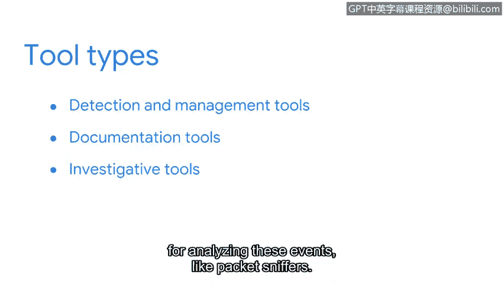

# 054：事件响应工具 🛠️

在本节课中，我们将学习安全分析师在事件检测与响应过程中所使用的各类工具。你将了解到，就像工匠需要多种工具来完成工作一样，安全分析师也需要一个多样化的“工具箱”来有效地监控、检测和分析安全事件。

---

作为一名安全分析师，你将在事件检测中扮演重要角色。毕竟，你将身处主动检测威胁的第一线。要做到这一点，你不仅需要依赖目前已掌握的安全知识，还需要使用各种工具和技术来支持你的调查工作。

一位优秀的木匠不会只用一把锤子来制作家具。他们会依赖工具箱里的各种工具来完成工作。他们需要使用卷尺测量尺寸，用锯子切割木材，用砂纸打磨表面。同样，作为一名安全分析师，你也不会只用单一工具来监控、检测和分析事件。

上一节我们介绍了事件检测的基本概念，本节中我们来看看支持这些工作的具体工具。你将使用检测与管理工具来监控系统活动，以识别需要调查的事件。你将使用文档工具来收集和汇编证据。你还会使用不同的调查工具来分析这些事件，例如数据包嗅探器。

---

新的安全技术不断涌现，威胁不断演变，攻击者也变得更加隐蔽以规避检测。为了有效地检测威胁，你需要持续扩展你的安全工具箱。这也正是安全领域如此令人兴奋的原因——总有新东西需要学习。

你可能还记得我们在上一节与你分享的“事件处理者日志”。在本课程的后续部分，你将把这份日志作为你自己的文档形式来使用。请将其视为你添加到工具箱中的第一个安全工具。

---

本节课中我们一起学习了安全分析师在事件响应中所需的各种工具。我们了解到，一个多样化的工具箱对于有效监控、检测和分析安全事件至关重要。从检测工具到文档工具，每一种都在调查过程中发挥着独特的作用。请记住，随着威胁形势的不断变化，持续学习和更新你的工具集是成为一名成功的安全分析师的关键。