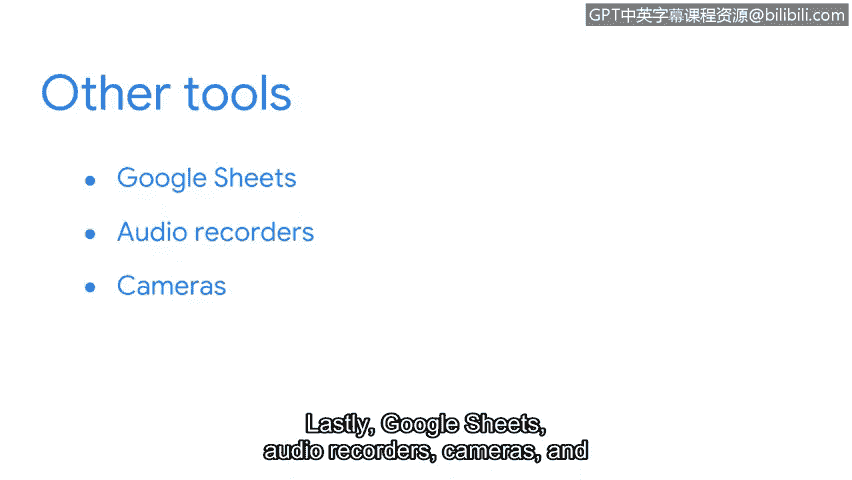

# 055：文档的价值 📄

在本节课中，我们将探讨文档在网络安全事件响应中的核心价值。我们将了解不同类型的文档、有效文档的重要性，以及一些实用的文档工具。

## 文档的定义与类型

上一节我们介绍了事件处理者日志的用途，本节中我们来看看文档的广泛定义及其常见类型。

文档是为特定目的而记录的任何形式的内容。这包括音频、数字或手写说明，甚至视频。目前没有统一的行业标准，因此许多组织会制定自己的文档实践。无论如何，文档旨在为特定主题提供指导和说明。

文档有多种类型，您可能已从之前的课程中熟悉了其中一些。以下是常见的文档类型：

*   **预案手册**：提供任何操作行动的详细步骤。
*   **事件处理者日志**：用于记录事件的五个W（何人、何事、何地、何时、为何）。
*   **策略**：规定组织的安全要求和规则。
*   **计划**：概述应对特定情况的整体方案。
*   **最终报告**：总结事件处理过程和结果。

请记住，由于没有行业标准，一个组织的文档实践可能与另一个组织完全不同。组织通常会根据自身需求和法律要求定制其文档实践，可能会增加、删除甚至合并文档类型。

## 有效文档的重要性

理解了文档的类型后，我们来看看为什么制作有效的文档至关重要。

您是否曾购买产品后不知如何使用，于是查阅产品手册以获取操作说明？恭喜，您已经使用文档解决了问题。之前我们学习过预案手册如何保障业务运营安全和事件响应。预案手册的工作原理类似于产品手册。作为复习，**预案手册**是提供任何操作行动细节的手册。您将在后续课程中了解更多关于预案手册的内容。

让我们回到产品手册的例子。您是否曾因需要帮助而查阅产品手册，却发现说明令人困惑，无法获得所需的帮助？无论是由于不清晰的视觉说明还是混乱的布局，您都未能使用文档解决问题。这就是**无效文档**的一个例子。

有效的文档能减少不确定性和混乱。这在安全事件期间至关重要，因为当时气氛紧张且需要紧急响应。作为安全专业人员，您将经常使用和创建文档。确保您使用和制作的文档清晰、一致且准确至关重要，这样您和您的团队才能迅速果断地响应。

## 文档工具简介

了解了有效文档的原则后，我们来看看有哪些工具可以帮助我们进行记录。

文字处理器是记录文档的常用方式。一些流行的工具包括 `Google Docs`、`OneNote`、`Evernote` 和 `Notepad++`。像 `JIRA` 这样的工单系统也可用于记录和跟踪事件。最后，`Google Sheets`、录音设备、摄像机和手写笔记也是您可以用来记录的工具。

---

本节课中我们一起学习了文档在网络安全中的价值，包括其定义、主要类型、有效性的重要性以及一些实用的记录工具。我们关于文档的讨论才刚刚开始，很快您将使用您的事件处理者日志来实践您的文档技能。