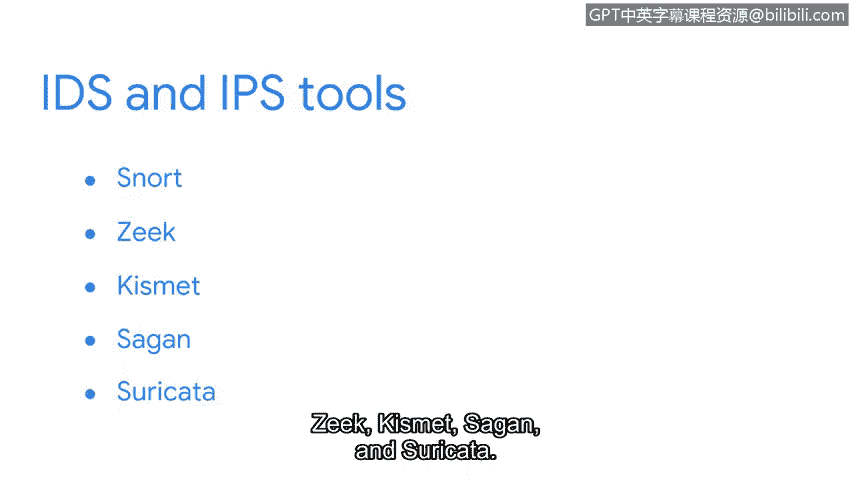

**网络安全基础：第六课：入侵检测与防御系统简介**

在本节课中，我们将学习网络安全中的两个核心概念：入侵检测系统与入侵防御系统。我们将了解它们的工作原理、区别以及在实际环境中的应用。

---

想象一下，你刚刚在家中安装了一套入侵安防系统。你在家中的每个出入口，包括门和窗户，都安装了入侵传感器。这些传感器通过发出声波来工作。当有物体触碰到声波时，声波会反射回传感器，并触发一个警报发送到你的手机，通知你检测到入侵。

入侵检测系统的工作原理与家庭入侵传感器非常相似。**入侵检测系统**是一种监控系统和网络活动，并对可能的入侵行为发出警报的应用程序。与家庭入侵传感器一样，IDS收集并分析系统信息以发现异常活动。一旦检测到异常，IDS会向适当的渠道和人员发送警报。

现在，想象一家珠宝店的橱窗传感器。当传感器检测到橱窗玻璃被打碎时，它会触发一个钢制卷帘门自动升起，替换被打碎的窗户，从而阻止未经授权的进入。这就是**入侵防御系统**的功能。入侵防御系统拥有IDS的所有能力，但它能更进一步：它不仅监控系统活动以发现入侵，还会采取行动来阻止入侵。

许多工具同时具备IDS和IPS的功能。以下是一些流行的工具：
*   Snort
*   Zeek
*   Kismet
*   Security Onion
*   Suricata

在接下来的课程中，我们将探索Suricata工具。

你可能会好奇这些警报通知会发送到哪里。接下来，我们将讨论如何使用安全信息与事件管理工具来管理这些警报。

---

本节课中，我们一起学习了入侵检测系统与入侵防御系统的基本概念。IDS负责监控和告警，而IPS则在告警的基础上增加了主动阻止的能力。它们是网络安全监控体系中至关重要的组成部分。