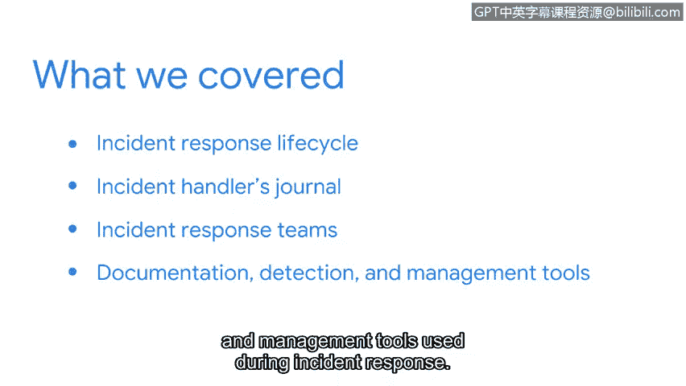

# 058：章节总结

## 概述
在本节课程中，我们学习了网络安全事件响应的核心框架与工具。本节内容为事件响应流程奠定了基础。

---

## 章节回顾 🎯

祝贺你完成了新章节的学习。你掌握了大量知识。

作为回顾，我们首先介绍了**事件响应生命周期**，这是一个支撑事件响应流程的框架。

你还获得了专属于你的**事件处理日志**，用于记录事件调查过程。你将在本课程的后续部分继续使用它。

上一节我们介绍了事件响应的框架，本节中我们来看看团队如何协作。你探索了事件响应团队如何利用**事件响应计划**协同工作以应对安全事件。

你还学习了在事件响应过程中使用的**文档、检测与管理工具**。

---

## 总结
恭喜你完成了事件响应学习之旅的第一部分。接下来，我们将探索网络监控。你也将有机会通过实践活动来应用所学知识。

我们下一节再见。😊