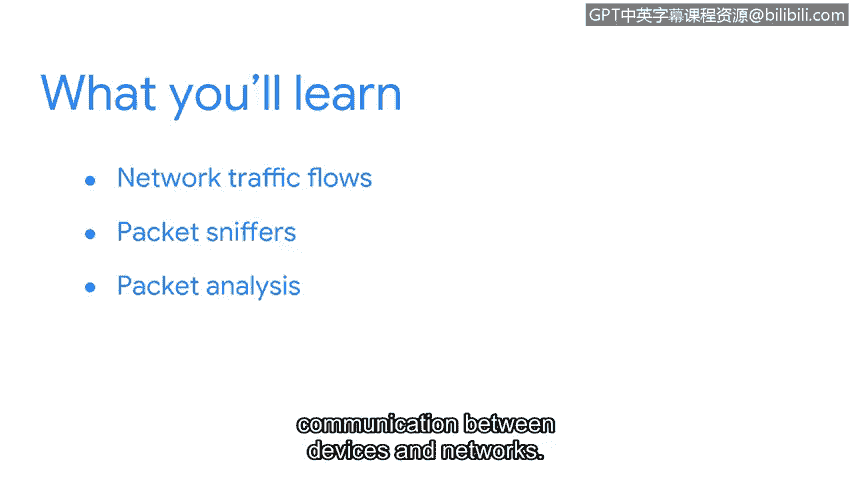

# 059：12_01_welcome-to-week-2

欢迎回来。很高兴你加入我们。

在上一节内容中，我们介绍了事件检测与响应。你可能还记得在之前的课程中学习了网络相关知识。简单回顾一下，你学习了设备如何利用网络协议进行通信，以及不同类型的网络攻击。你也研究了一些网络安全最佳实践。

在本节中，我们将扩展网络知识，并将重点转向网络分析。首先，你将通过探索网络流量流来检查网络通信。接下来，你将学习如何使用数据包嗅探器查看和捕获网络流量。然后，你将接触数据包分析，在其中检查数据包字段并解码设备与网络之间的通信。

作为一名安全专业人员，你的任务将是监控网络和系统基础设施，以检测恶意活动。本节内容将为你提供机会，发展你的网络和数据包分析技能。

你准备好开始了吗？让我们开始吧。

