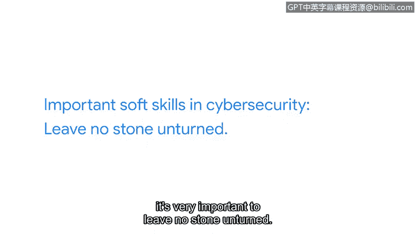

# 060：13_02_casey-应用网络安全中的软技能


## 概述
在本节课中，我们将跟随谷歌云企业安全销售团队的凯西，学习在网络安全领域至关重要的软技能。我们将探讨这些技能的重要性以及如何应用它们。

## 核心建议：立即行动
凯西给出的首要建议是：立即投身于网络安全领域。网络安全世界永不停歇、不断变化，这正是其魅力所在。这个领域需要更多样化的人才参与，需要拥有不同思想、背景和视角的每一个人。

## 关键软技能一：清晰沟通
在网络安全领域，最重要的软技能之一是能够清晰地总结你想表达的内容。这项技能至关重要。

**核心公式**：`有效沟通 = 清晰总结 + 准确传达`

## 关键软技能二：开放心态
上一节我们介绍了清晰沟通的重要性，本节中我们来看看另一项可能更为关键的软技能：以开放的心态工作。

威胁形势在不断变化，威胁行为者从不休息，因此我们也必须保持警惕。网络安全之所以有趣，正是因为它持续变化。如果我们带着固定心态进入这个领域，认为自己已经知道答案、完全了解情况，那么我们注定会失败。

我们必须始终保持好奇心。从网络安全的角度来看，**不放过任何蛛丝马迹**至关重要。

**核心代码**：
```python
# 模拟开放心态的伪代码
while True:  # 持续学习循环
    if new_threat_emerges():  # 如果出现新威胁
        investigate()  # 调查
        learn_and_adapt()  # 学习并适应
    maintain_curiosity()  # 保持好奇心
```

## 软技能的普遍性与优势
关于软技能，最棒的一点是我们每个人都拥有它们，并且每天都在使用。因此，每一位观看本课程的学习者，在网络安全领域都已经拥有了先发优势。




## 总结
本节课中我们一起学习了网络安全从业者必备的两项核心软技能：**清晰沟通**与**开放心态**。我们了解到，网络安全是一个需要持续学习、适应和保持好奇心的动态领域。请记住，你已经具备了开启职业生涯所需的软技能基础。