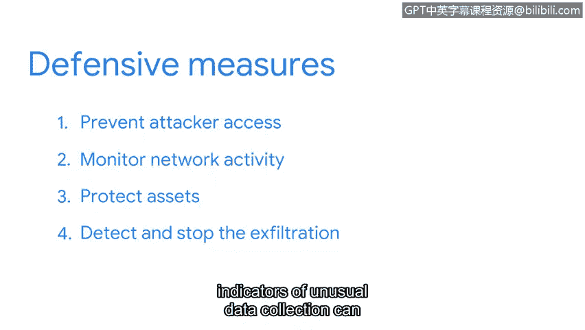

# 062：数据窃取攻击的检测与响应 🚨

在本节课中，我们将学习数据窃取攻击的完整过程，包括攻击者的视角和防御者的应对策略。我们将了解攻击者如何逐步渗透网络、窃取数据，以及安全团队如何通过监控和响应来检测并阻止此类攻击。

监控网络流量有助于安全专业人员检测、预防和响应攻击。根据我的安全专业经验，监控网络流量模式中的异常情况能带来显著成效。即使信息经过加密，出于安全目的，监控网络流量仍然至关重要。

让我们探讨一下在数据窃取攻击中，检测与响应流程是如何运作的。首先，我们将从攻击者的视角进行概述。

## 攻击者视角

在攻击者能够执行数据窃取之前，他们需要首先获得对网络和计算机系统的初始访问权限。这可以通过网络钓鱼等社会工程学攻击来实现，此类攻击诱骗人们泄露敏感数据。攻击者可以发送带有附件或链接的钓鱼邮件，诱骗目标输入其凭据。至此，攻击者已成功获得对其设备的访问权限。

在获得系统的初始立足点后，攻击者不会就此止步。他们的目标是在环境中维持访问权限，并尽可能长时间地避免被检测到。为此，他们会执行一种称为横向移动或渗透的战术。这意味着他们会花费时间探索网络，目标是扩大并维持其对网络上其他系统的访问权限。

当攻击者在网络中渗透时，他们会侦察环境，以识别有价值的资产，例如敏感数据。这些资产可能包括专有信息、姓名和地址等个人身份信息或财务记录。他们通过搜索网络文件共享、内联网站点、代码仓库等位置来完成此操作。

在攻击者识别出有价值的资产后，他们需要收集、打包并准备数据，以便将其从组织的网络窃取到攻击者手中。他们可能采取的一种方法是减少数据大小。这有助于攻击者隐藏被盗数据并绕过安全控制。最后，攻击者会将数据窃取到他们选择的目的地。实现此目的的方法有很多，例如，攻击者可以使用被入侵的电子邮件账户将窃取的数据发送给自己。

## 防御者策略

现在您已经了解了攻击者的视角，让我们探讨组织如何防御此类攻击。

首先，安全团队必须阻止攻击者访问。您可以使用多种方法来保护网络免受钓鱼攻击。例如，要求用户使用多因素认证。

获得网络访问权限的攻击者可能会在一段时间内不被察觉。因此，安全团队监控网络活动以识别可能表明系统被入侵的任何可疑活动至关重要。例如，应调查来自网络外部IP地址的多次用户登录。

之前，您学习了如何使用资产清单和安全控制来识别、分类和保护资产。作为组织安全策略的一部分，所有资产都应记录在资产清单中。同时，应应用适当的安全控制措施来保护这些资产免遭未经授权的访问。

最后，如果数据窃取攻击成功，安全团队必须检测并阻止数据窃取。为了检测攻击，可以通过网络监控识别异常数据收集的指标。这些指标包括大量的内部文件传输、大量的外部上传以及意外的文件权限变更。

SIEM工具可以检测这些活动并发出警报。一旦警报发出，安全团队将进行调查并阻止攻击继续进行。阻止此类攻击的方法有很多。例如，一旦识别出异常活动，您可以使用防火墙规则阻止与攻击者相关的IP地址。

数据窃取攻击只是众多可以通过网络监控检测到的攻击之一。接下来，您将学习如何使用数据包嗅探器来监控和分析网络通信。

## 总结

本节课中，我们一起学习了数据窃取攻击的完整生命周期。我们从攻击者的角度，了解了他们如何通过初始访问、横向移动、资产识别、数据打包，最终完成数据窃取。随后，我们从防御者的角度，探讨了如何通过预防访问、持续监控、资产保护以及利用SIEM工具检测和响应警报来构建防御体系。理解攻防双方的视角，是有效进行网络安全检测与响应的关键。