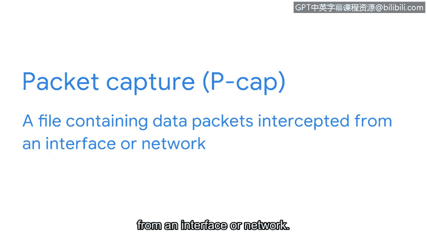

# 063：数据包与数据包捕获

在本节课中，我们将学习网络通信的基本单位——数据包，以及如何通过数据包捕获技术来记录和分析网络流量。理解这些概念对于检测网络中的异常活动和潜在威胁至关重要。

无论是员工发送电子邮件，还是恶意行为者试图窃取机密数据，在网络中执行的操作都可以通过检查网络流量来识别。理解这些网络通信能为我们提供关于网络活动的宝贵洞察，从而更好地了解环境状况并防御潜在威胁。

基于此，让我们来探讨如何通过数据包捕获来记录网络流量。

## 数据包基础

在之前的课程中我们了解到，发送数据时，数据会被分割成数据包。就像邮寄的信封一样，数据包包含投递信息，用于将其路由到目的地。这些信息包括发送方和接收方的IP地址、正在发送的数据包类型等。数据包可以提供大量关于网络设备间通信的信息。

你可能还记得，一个数据包包含多个组成部分。

以下是数据包的主要组成部分：

*   **报头**：包含诸如所使用的网络协议类型和端口等信息。可以将其想象为信封上的姓名和邮寄地址。
    *   **网络协议**：是决定网络设备间数据传输规则的一组规则。
    *   **端口**：是计算机上用于组织网络设备间数据传输的非物理位置。
    *   报头还包含数据包的源IP地址和目的IP地址。我们将在后续章节中探讨报头包含的更多信息。
*   **载荷**：包含正在传递的实际数据。这就像信封里信件的内容。
*   **报尾**：标志着一个数据包的结束。

## 捕获与分析数据包

那么，如何才能观察到网络数据包呢？就像气味无形但可以被闻到一样，数据包虽然不可见，但可以使用称为数据包嗅探器的工具来捕获。

你可能在之前的章节中还记得数据包嗅探器。**网络协议分析器**或**数据包嗅探器**是一种旨在捕获和分析网络内数据流量的工具。

作为安全分析师，你将使用数据包嗅探器来检查数据包，以发现入侵指标。通过数据包嗅探，我们可以以数据包捕获的形式，获取流经网络的详细数据包快照。

**数据包捕获**或 **Pcap** 是一个包含从接口或网络截获的数据包的文件。这有点像截获邮件中的信封。

Pcap捕获在事件调查期间极其有用。通过访问网络设备间的通信，你可以观察网络交互，并开始构建事件脉络以确定究竟发生了什么。

接下来，我们将讨论数据包分析的重要性。我们稍后见。

---

**本节课总结**：我们一起学习了数据包的结构（包括报头、载荷和报尾），了解了网络协议和端口的作用，并介绍了使用数据包嗅探器进行数据包捕获（Pcap）的基本概念。这是分析网络流量、检测异常和调查安全事件的基础技能。