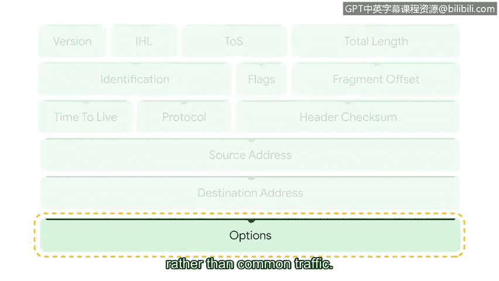

# 065：深入解析数据包头部字段 🔍

在本节课中，我们将学习如何手动分析和解读网络数据包。作为安全分析师，掌握这项技能至关重要。我们将重点剖析IP数据包头部，了解其各个字段的含义和作用，从而理解数据在网络中是如何被组织和传输的。

## 数据包与IP头部概述

上一节我们介绍了TCP/IP模型的四层结构。本节中，我们来看看数据包在其中的关键组成部分——IP头部。TCP/IP模型是一个用于可视化数据如何在网络中组织和传输的框架。网络层负责接收和传递数据包，也是互联网协议运作的层面，它是所有互联网通信的基础，确保数据包能够到达目的地。

互联网协议的工作方式类似于邮递员投递信件。它不使用信封上的投递信息，而是使用数据包头部的信息，如IP地址，来确定数据包传输的最佳可用路径，从而实现主机之间的数据发送和接收。

## IP头部字段详解

正如你所知，IP数据包包含头部。头部包含了将数据传输到预定目的地所必需的数据字段。不同的协议使用不同的头部。互联网协议有两个主要版本：**IPv4**（被视为互联网通信的基础）和**IPv6**（最新的互联网协议版本）。不同协议使用不同的头部，因此IPv4和IPv6的头部结构不同，但包含名称不同但功能相似的字段。目前IPv4仍是最广泛使用的协议，因此我们将重点解析IPv4头部字段。

以下是IPv4头部的主要字段及其功能：

*   **版本**：此字段指定所使用的IP版本，即IPv4或IPv6。可以类比为邮件的不同类别，如优先、特快或平邮。
*   **头部长度**：此字段指定IP头部的长度加上任何选项的长度。
*   **服务类型**：此字段指示某些数据包是否应得到不同的处理。可以类比为邮寄包裹上的“易碎品”标签。
*   **总长度**：此字段标识整个数据包（包括头部和数据）的长度。可以类比为信封的尺寸和重量。
*   **标识、标志、片偏移**：这三个字段处理与**分片**相关的信息。分片是指一个IP数据包被分解成多个块，通过线路传输，并在到达目的地时重新组装。这些字段指定是否使用了分片以及如何按正确顺序重新组装被分解的数据包。这类似于邮件在到达目的地前可能经过多个路径，如邮箱、处理设施、飞机和邮车。
*   **生存时间**：顾名思义，此字段决定数据包在被丢弃前可以存活的时间。没有这个字段，数据包可能会在路由器间无限循环。TTL类似于跟踪信息提供的信封预计送达日期。
*   **协议**：此字段通过提供一个对应特定协议的值来指定所使用的协议。例如，TCP协议用数字`6`表示。这类似于在邮政地址中包含门牌号。
*   **头部校验和**：此字段存储一个称为校验和的值，用于检测头部是否发生了任何错误。
*   **源地址**：此字段指定源IP地址。
*   **目的地址**：此字段指定目的IP地址。这就像信封上找到的寄件人和收件人联系信息。
*   **选项**：此字段不是必需的，通常用于网络故障排除，而非普通流量。如果使用此字段，头部长度会增加。这就像为信封购买邮政保险。

最后，在数据包头部的末尾是数据包的数据所在位置，就像电子邮件中的正文内容。

## 总结

本节课中，我们一起学习了如何手动分析网络数据包的核心——IP头部。我们详细探讨了IPv4头部中的各个关键字段，包括版本、长度、地址信息、生存时间等，并通过与邮政系统的类比，理解了每个字段在网络通信中扮演的角色。这些信息是安全分析师进行网络流量分析、检测异常和响应安全事件的基础。接下来，你将有机会详细检查这些数据包字段。