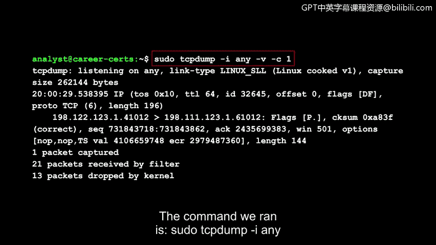
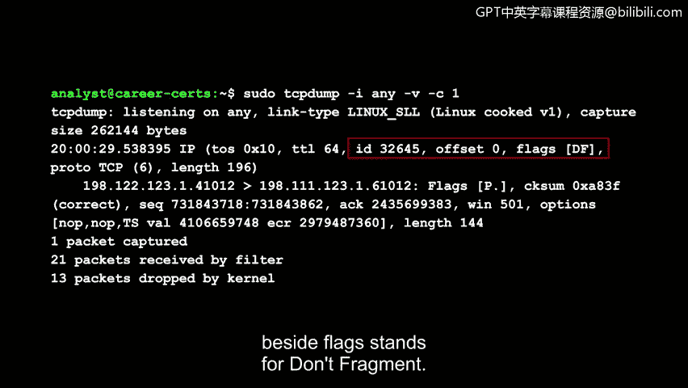
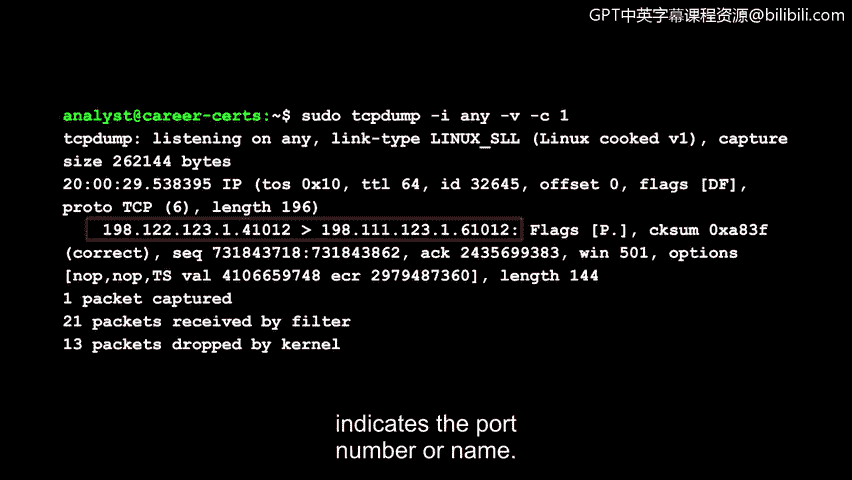
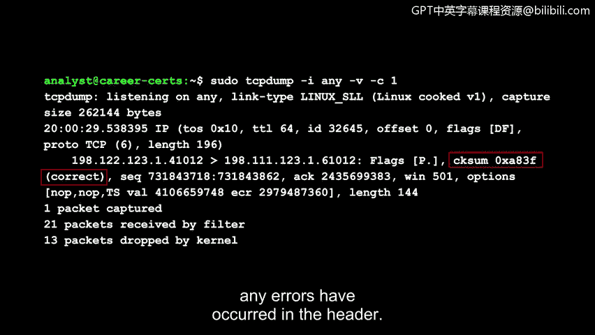
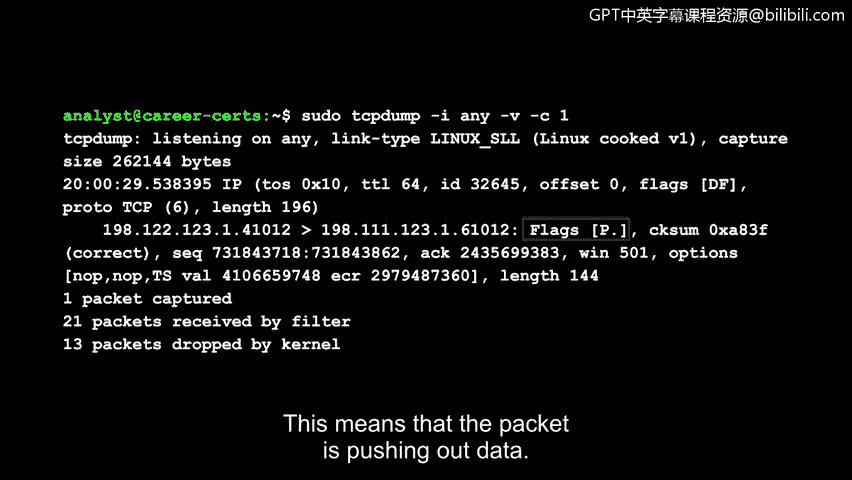

# 066：使用tcpdump进行数据包捕获

在本节课中，我们将要学习如何使用一个名为`tcpdump`的强大命令行工具来捕获和分析网络数据包。`tcpdump`是网络安全分析中不可或缺的工具，能够帮助我们深入了解网络通信的细节。

## 什么是tcpdump？

`tcpdump`是一个流行的网络分析器。它预装在许多Linux发行版上，并且可以安装在大多数类Unix操作系统上，例如macOS。

`tcpdump`是一个命令行工具。这意味着它没有图形用户界面。在本课程的前期，你已经了解到命令行是一个非常强大且高效的工具。现在，我们将练习将其与`tcpdump`结合使用。

你可以通过为命令应用选项和标志来轻松过滤网络流量，从而精确地找到你想要查看的内容。例如，你可以过滤特定的IP地址、协议或端口号。

## 一个简单的tcpdump命令示例

让我们来检查一个用于捕获数据包的简单`tcpdump`命令。请注意，当你使用此命令时，你计算机上的流量显示可能会有所不同。

我们运行的命令是：`sudo tcpdump -i any -v -c 1`。

*   **`sudo`**：因为我们登录的Linux帐户没有运行`tcpdump`的权限，所以使用`sudo`来获取管理员权限。
*   **`tcpdump`**：启动`tcpdump`程序。
*   **`-i any`**：`-i`选项用于指定我们要监听流量的网络接口。`any`表示监听所有可用的网络接口。
*   **`-v`**：代表详细模式，用于显示详细的数据包信息。
*   **`-c 1`**：`-c`代表计数，用于指定`tcpdump`将捕获的数据包数量。这里我们指定为1个。

## 解读tcpdump输出

乍一看，输出信息量很大。让我们逐行分析。

首先，`tcpdump`告诉我们它正在监听所有可用的网络接口，并提供了捕获大小等附加信息。

以下是输出的核心字段解析：

**时间戳**
第一个字段是数据包的时间戳，详细记录了数据包传输的具体时间。它以小时、分钟、秒和小数秒开始。在事件调查中，时间戳对于确定时间线和关联流量非常有帮助。

**IP数据包头部信息**
接下来是IP版本字段，这里显示为`IP`，意味着是IPv4。详细选项`-v`为我们提供了更多关于IP数据包字段的细节，例如协议类型和数据包长度。

以下是IP头部中的关键字段：
*   **`tos`**：代表服务类型。它指示某些数据包是否应得到不同的处理优先级，其值以十六进制表示。
*   **`ttl`**：代表生存时间。它告诉我们一个数据包在被丢弃前可以在网络中传输多久。
*   **`id`， `offset`， `flags`**：这三个字段提供与数据包分片相关的信息。它们提供了如何按正确顺序重组数据包的指令。例如，`flags`旁边的`DF`代表“不分片”。
*   **`proto`**：协议字段。它指定正在使用的协议，并提供与该协议对应的数值。在此示例中，协议是TCP，由数字6表示。
*   **`length`**：数据包的总长度，包括IP头部。

**通信端点**
接下来，我们可以观察到正在相互通信的IP地址。箭头方向指示了流量的方向。IP地址的最后一部分指示了端口号或服务名称。

**校验和与TCP信息**
*   **`cksum`**：校验和字段，存储一个用于判断头部是否发生错误的值。这里显示为`correct`，表示没有错误。
*   其余字段与TCP协议相关。例如，`Flags`指示TCP标志位。示例中的`P`是推送标志，而句点`.`表示确认标志。这意味着该数据包正在推送数据。

## 总结

本节课中，我们一起学习了`tcpdump`的基本用法。我们了解了如何通过一个简单的命令`sudo tcpdump -i any -v -c 1`来捕获数据包，并详细解读了输出结果中的各个关键字段，包括时间戳、IP头部信息、通信端点以及TCP标志位。这只是你可以在`tcpdump`中使用的众多命令之一，用于捕获和分析网络流量。观察这些无形数据包中包含的所有信息非常有趣，请亲自尝试一下吧。