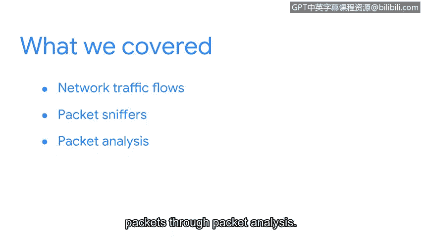

# 067：检测与响应

## 概述
在本节课中，我们将回顾并总结网络流量分析与数据包捕获的核心技能。这些技能是检测潜在安全威胁和进行事件响应的基础。

## 课程回顾与总结 🎯

到目前为止，你做得很好。祝贺你成功捕获并分析了第一个数据包。

让我们回顾一下目前已涵盖的内容。

首先，你学习了网络流量如何为通信提供有价值的洞察。这是通过监控网络活动以寻找入侵指标来实现的。

### 已掌握的关键技能
以下是我们在本阶段学习的核心内容：

1.  **识别异常网络活动**
    你学会了如何发现异常的网络活动，例如数据渗漏。

2.  **使用数据包嗅探器**
    你学会了如何使用数据包嗅探器来查看和捕获网络流量。

3.  **进行数据包分析**
    你学会了如何通过数据包分析来检查数据包。这包括剖析数据包头部的数据字段，并详细分析数据包捕获文件。

### 技能进展与展望
你在培养入门级安全职位所需技能方面取得了很大进展。

接下来，你将沉浸到事件调查的精彩世界中。在那里，你将研究检测和遏制安全事件背后的流程。

我将在那里与你相见。😊

## 总结
本节课中，我们一起学习了网络流量监控的重要性、识别异常活动的方法、使用工具捕获数据包以及深入分析数据包结构的技能。这些是网络安全分析师进行威胁检测和事件响应的基础能力。