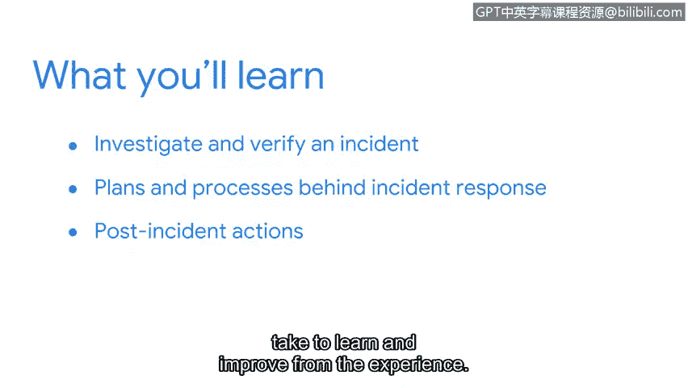

# 068：安全事件生命周期管理

## 概述

在本节课中，我们将要学习安全事件从发生到结束的完整生命周期。我们将重点关注如何检测、响应安全事件，并从事件中恢复。通过本部分的学习，你将获得对事件处理流程的全面理解。

欢迎回来。你在目前阶段的表现非常出色。

你正在学习的这些技能，将为开启你的安全职业生涯打下坚实的基础。

## 从网络分析到事件响应

上一节中，你应用了网络知识来加深对网络流量的理解。你练习了一些安全分析师在实际工作中使用的技能，例如捕获网络流量和分析数据包。

接下来，我们将从头到尾地审视一个安全事件的生命周期。

## 本节核心学习目标

以下是本节你将重点学习的内容：

*   你将学习在检测到安全事件后，如何进行调查和验证。
*   你将探索事件响应背后的计划和流程。
*   最后，你将了解组织在事件发生后所采取的、用于从经验中学习和改进的后续行动。

在本节结束时，你将全面理解一个安全事件的生命周期。

你已经准备好了。让我们开始吧。