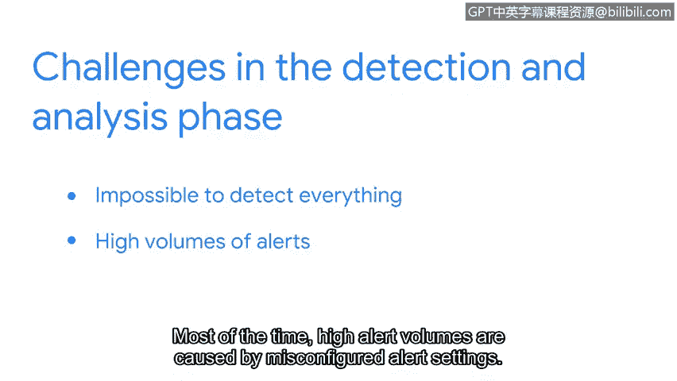

# 069：检测与响应生命周期中的检测与分析阶段 🔍

在本节课中，我们将学习安全事件响应生命周期中的“检测与分析”阶段。我们将了解安全事件如何被发现、如何进行分析验证，以及安全分析师在此过程中面临的挑战和所需技能。

上一节我们介绍了安全事件响应的整体框架，本节中我们来看看其核心的起始阶段——检测与分析。

## 检测阶段

检测阶段的目标是及时发现安全事件。需要明确的是，并非所有“事件”都是“安全事件”。事件是业务运营中的常规活动，例如访问网站或重置密码请求。而安全事件则是指违反安全策略、威胁到信息资产机密性、完整性或可用性的行为。其关系可以概括为：

**公式：** 安全事件 ⊆ 事件

安全信息和事件管理工具会从不同来源收集并分析事件数据，以识别潜在的可疑活动。如果检测到安全事件，例如恶意行为者成功获得了对某个账户的未授权访问，系统就会发出警报。

## 分析阶段

当警报发出后，安全团队便进入分析阶段。分析阶段涉及对警报的调查与验证。在此过程中，分析师必须运用批判性思维和事件分析技能来调查和验证警报。他们会检查入侵指标，以确定是否真的发生了安全事件。

然而，分析工作面临几项挑战。

以下是分析师在检测与分析阶段面临的主要挑战：

1.  **检测的局限性**：不可能检测到所有威胁。即使优秀的检测工具，其工作方式也存在局限。此外，由于资源有限，自动化工具可能无法在组织内全面部署。
2.  **不可避免的事件**：某些安全事件是不可避免的，这就是为什么组织制定事件响应计划至关重要。
3.  **海量警报**：分析师每班次通常会收到大量警报，有时甚至成千上万。大多数情况下，高警报量是由警报设置配置不当引起的。例如，过于宽泛且未根据组织环境进行调整的警报规则会产生大量误报。
4.  **真实攻击激增**：其他时候，高警报量也可能是由恶意行为者利用新发现的漏洞发起的真实攻击所导致的合法警报。

## 总结

本节课中我们一起学习了事件响应生命周期的检测与分析阶段。我们明确了检测的目标是发现安全事件，而分析的核心是对警报进行验证与调查。同时，我们也认识到分析师在实际工作中需要应对检测工具局限性、海量警报（包括误报和真实攻击）等挑战。作为一名安全分析师，掌握有效分析警报的能力至关重要，在接下来的课程中，你将进行相关的实践。