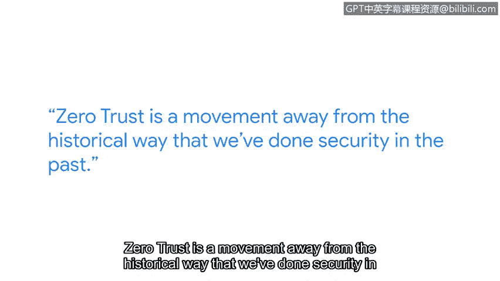

# 070：网络安全行业的变革 🔄

在本节课中，我们将学习网络安全行业的发展趋势与核心挑战，特别是关于零信任架构的兴起及其对安全从业者能力的要求。

大家好，我是 M.K.，担任谷歌云首席安全官办公室的总监。

我的职责是从安全角度保护谷歌云，同时确保我们提供所有必要的工具和产品，以便我们的客户也能实现其安全目标。

## 行业现状与挑战

上一节我们介绍了课程背景，本节中我们来看看网络安全行业当前面临的核心挑战。

该行业普遍缺乏一种对手却大量具备的敏捷性。当攻击者发现某种方法有效时，他们会持续使用，直到遇到障碍。一旦障碍出现，他们已展现出能够轻松调整战术和技术的能力，以便在未来尝试入侵时绕过这些障碍。

因此，我们无人能预测未来。我们并未处于任何最终阶段，这是一个持续演进的行业。你可以确定的是，我们需要以多种方式做好准备，以应对对手必将发起的持续攻击。

## 应对挑战所需的能力

这要求我们具备一定的敏捷性。你必须习惯于在未知中工作，同时必须具备足够的智力才能，以便能够即时消化信息并制定新的解决方案。

以下是应对未来挑战所需的关键能力：
*   **适应未知**：习惯于在不明确和变化的环境中工作。
*   **快速学习与创新**：具备即时消化新信息并制定有效解决方案的智力。

## 零信任架构的兴起

接下来，我们将探讨当前网络安全领域的一个重要趋势：零信任。

零信任目前是一个巨大的趋势，因为它既是行业向零信任发展的愿望，也是世界某些地区的法规要求。

零信任是对我们过去传统安全方式的转变。用通俗的话说，假设你是一名商务旅行者，带着商务笔记本电脑入住世界另一端的酒店，需要为即将召开的商务会议做准备。传统上，你需要证明自己是企业内试图访问信息的合法用户。是的，基于你所拥有的身份信息，并结合设备信息，该用户和设备应有权访问此信息并做出决策。

## 未来展望与持续学习

我相信，我们在零信任方法或架构上投入越多，就能达到一个更好的起点。但我认为未来的许多事情仍是未知的，这意味着我们需要持续学习。这意味着不断让自己接触行业的不同领域，以便为未来可能发生的情况做好准备。

本节课中我们一起学习了网络安全行业的动态本质、对手的敏捷性、以及零信任作为关键应对策略的兴起。核心在于，安全从业者必须培养适应性和持续学习的能力，以应对不断演变的威胁。