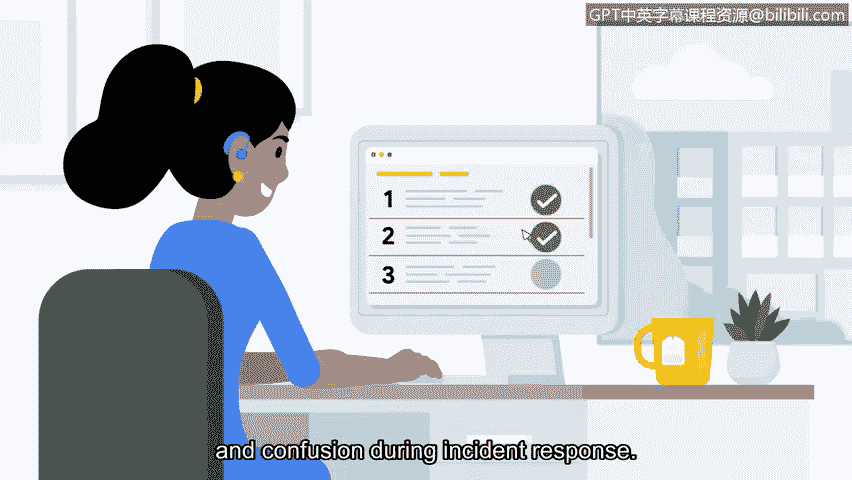

# 071：文档化的益处 📝

在本节课程中，我们将探讨安全团队在事件响应过程中进行文档记录所带来的核心益处。理解这些益处将帮助你作为一名安全专业人员，更有效地利用文档这一工具。

你可能还记得我们之前讨论过安全团队在响应事件时使用的不同文档工具和类型。

## 文档化的核心益处

上一节我们介绍了文档的类型，本节中我们来看看文档化能带来哪些具体的好处。

### 实现可扩展性与透明度

文档的首要益处是实现团队工作的可扩展性。作为一名编写了大量检测规则的安全工程师，记录以下信息至关重要：规则触发意味着什么、应分配何种严重级别、哪些情况可能导致误报，以及分析师如何确认警报是真实的。如果没有这些文档，安全运营团队的规模将永远无法超越一两个分析师。

如果事件被记录下来，就意味着它发生的经过有据可查。这使得相关人员能够获取关键信息，这一特性被称为**透明度**。透明的文档可作为安全保险索赔、合规性调查和法律诉讼的证据来源。在后续章节中，你将了解更多有助于实现这一目标的文档流程。

### 提供标准化与清晰度

文档化还提供了**标准化**。这意味着组织成员可以遵循一套既定的指南或标准来完成某项任务或工作流程。

以下是创建标准化文档的一个例子：
*   建立组织的安全策略。
*   制定标准化的处理流程。
*   明确具体的操作步骤。

由于有既定的规则可循，这有助于维持工作质量。同时，文档也提升了**清晰度**。有效的文档不仅能让团队成员清楚了解自己的角色和职责，还能提供如何完成工作的信息。例如，提供详细指示的应急预案手册，能够在事件响应期间防止不确定性和混乱。

### 适应变化与辅助决策

安全领域在不断变化。威胁在演变，合规要求也可能改变。因此，定期维护、审查和更新文档以跟上任何变化至关重要。作为一名安全专业人员，你可能需要同时兼顾文档责任和其他任务。

花时间记录你的行动，能帮助你回忆事实和信息。你甚至可能会注意到之前采取的行动中存在某些疏漏。你花在文档记录上的时间不仅对你自己，对整个组织都极具价值。

## 总结

本节课中我们一起学习了文档化的多项关键益处：它使安全运营团队能够**扩展**，为行动提供**透明**的记录，建立**标准化**的工作流程以保障质量，提升工作的**清晰度**以指导团队，并能随着威胁和法规的**变化**而更新，最终通过记录过程辅助个人与组织的**决策**与知识积累。掌握这些益处，是有效利用文档这一强大工具的基础。