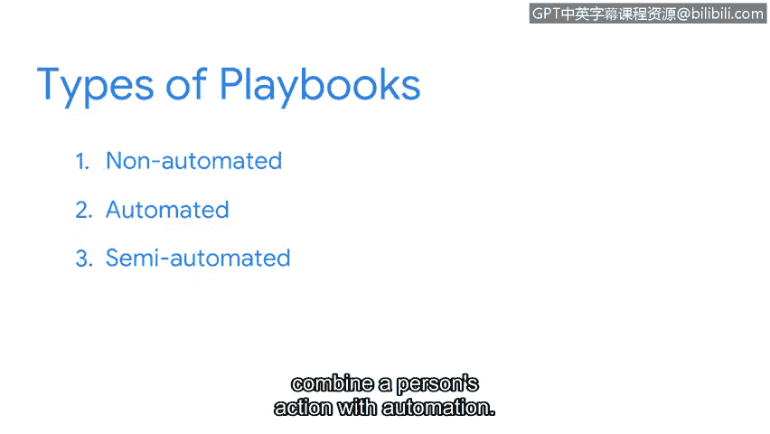

# 073：剧本的价值 📘

在本节课中，我们将要学习网络安全剧本的概念、类型及其在事件响应中的核心价值。剧本就像一份详细的旅行计划，为安全团队在应对突发事件时提供清晰的行动指南。

## 剧本是什么？🗺️

上一节我们介绍了事件响应的基本流程，本节中我们来看看如何让这个过程更加有序。剧本类似于旅行行程单。它是一种手册，为任何操作行动提供详细信息。它为安全分析师提供了事件发生时应采取的确切操作指令。剧本为安全专业人员在整个事件响应生命周期中的任务描绘了清晰的图景。

## 剧本的价值与必要性 ⚙️

响应事件有时是不可预测且混乱的。安全团队需要快速有效地行动。剧本通过清晰地概述响应特定事件时应采取的行动，为这一时期提供了结构和秩序。通过遵循剧本，安全团队可以减少响应期间的任何猜测和不确定性。这使得安全团队能够快速且毫不犹豫地行动。没有剧本，对事件进行有效且迅速的响应几乎是不可能的。

在剧本中，可能包含检查清单，这也能帮助安全团队在压力时期有效执行，提醒他们完成事件响应生命周期中的每一步。

## 剧本的应用示例 📋

以下是剧本如何应对特定攻击的步骤。剧本概述了应对勒索软件、数据泄露、恶意软件或DDoS等攻击所必需的步骤。

这里有一个使用流程图展示的剧本示例，描述了在检测到DDoS攻击时应采取的步骤。该图描绘了检测DDoS的过程，从确定入侵指标开始，例如未知的入站流量。一旦确定了入侵指标，下一步就是收集日志，最后分析证据。

## 剧本的三种类型 🔧

了解了剧本的基本构成后，我们来看看它的不同实现形式。剧本主要有三种类型：非自动化、自动化或半自动化。

我们刚才探讨的DDoS剧本是非自动化剧本的一个例子，它需要分析师执行逐步操作。自动化剧本则自动化了事件响应流程中的任务。例如，可以使用自动化剧本来完成诸如对事件严重性进行分类或收集证据等任务。自动化剧本有助于缩短事件解决时间。SOAR和SIEM工具可以配置来自动化剧本。

最后，半自动化剧本将人员操作与自动化相结合。繁琐、易出错或耗时的任务可以实现自动化，而分析师则可以优先处理其他任务。半自动化剧本有助于提高生产力并缩短解决时间。

## 剧本的维护与更新 🔄

随着安全团队响应事件，他们可能会发现剧本需要更新或更改。威胁在不断演变，为了使剧本保持有效，必须定期维护和更新。引入剧本更改的一个绝佳时机是在事件后活动阶段。我们将在接下来的章节中更详细地探讨这个阶段。

---

本节课中我们一起学习了网络安全剧本的核心概念。我们了解到剧本是指导事件响应的关键文档，它能提供结构、减少不确定性，并分为非自动化、自动化和半自动化三种类型。定期维护剧本对于应对不断变化的威胁至关重要。