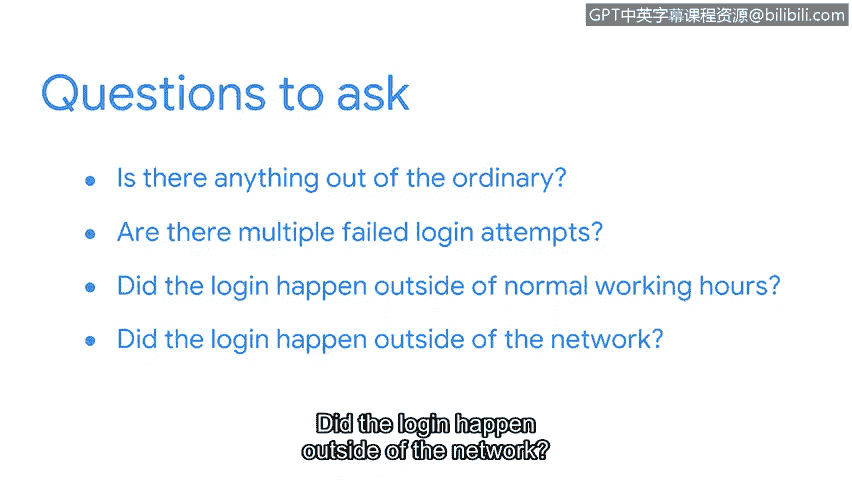

# 074：事件响应中的分诊角色 🚨

在本节课中，我们将要学习事件响应中的一个关键环节——分诊。你将了解分诊如何帮助安全分析师高效处理海量警报，并掌握其基本流程。

## 概述

正如你所了解到的，安全分析师在任何一天都可能被大量的警报所淹没。那么，分析师如何管理所有这些警报呢？医院急诊科每天会接收大量病人，每位病人因不同原因需要医疗护理，但并非所有病人都能立即得到救治。这是因为医院的资源有限，必须高效管理时间和精力。他们通过一个称为“分诊”的过程来实现这一点。

## 什么是分诊？

在医学领域，分诊用于根据病人病情的紧急程度对其进行分类。例如，患有心脏病等危及生命状况的病人会立即得到医疗关注，而手指骨折等非危及生命状况的病人可能需要在看医生前等待。分诊有助于管理有限的资源，使医护人员能够优先处理病情最紧急的病人。

分诊同样应用于安全领域。在警报升级之前，它会经过一个分诊过程，根据事件的重要性或紧急程度确定优先级。与医院急诊科类似，安全团队用于事件响应的资源也是有限的。

## 为何需要分诊？

并非所有事件都相同，有些可能需要紧急响应。事件根据其对系统**机密性、完整性和可用性**构成的威胁进行分诊。例如，涉及勒索软件的事件需要立即响应，因为勒索软件可能造成财务、声誉和运营损害。勒索软件的优先级高于员工收到钓鱼邮件这类事件。

## 分诊何时发生？

一旦检测到事件并发出警报，分诊就开始了。作为安全分析师，你将识别不同类型的警报，然后根据紧急程度确定其优先级。

## 分诊流程

分诊过程通常如下所示。以下是其核心步骤：

1.  **接收与评估警报**：首先，接收并评估警报，以确定它是否是误报，以及是否与现有事件相关。
2.  **分配优先级**：如果警报是真正的阳性事件（非误报），则根据组织的政策和指南为其分配优先级。优先级定义了安全团队将如何响应该事件。
3.  **调查与收集证据**：最后，调查警报，并收集和分析与警报相关的任何证据，例如系统日志。

作为分析师，你需要确保完成彻底的分析，以便有足够的信息对你的发现做出明智的决策。

## 调查中的上下文分析

例如，假设你收到了一个用户登录失败的警报。你需要为调查添加上下文，以确定其是否为恶意行为。你可以通过提问来实现：

*   此警报是否有任何异常之处？
*   是否存在多次失败的登录尝试？
*   登录是否发生在正常工作时间之外？
*   登录是否发生在网络外部？

这些问题描绘了事件的全貌。通过添加上下文，你可以避免做出可能导致不完整或错误结论的假设。

## 过渡到响应与恢复

现在我们已经介绍了如何对警报进行分诊，接下来我们准备讨论如何响应事件并从事件中恢复。让我们继续前进。

## 总结

本节课中，我们一起学习了事件响应中分诊的核心作用。我们了解到，分诊是一个根据紧急程度对警报进行优先级排序的关键流程，它帮助安全团队在资源有限的情况下，将精力集中在最紧迫的威胁上。流程包括评估警报、分配优先级和深入调查。通过为调查添加上下文，我们可以做出更准确的分析和决策。