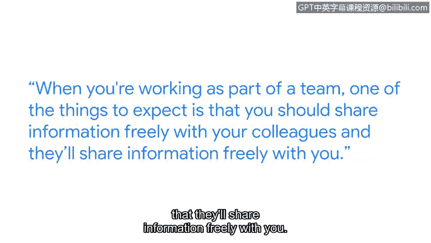

# 075：跨团队协作

## 概述
在本节课中，我们将跟随谷歌红队项目负责人罗宾，学习网络安全工作中至关重要的跨团队协作。我们将了解团队合作如何帮助应对复杂的安全挑战，并通过一个真实案例，体会有效协作带来的积极成果。

## 团队合作是网络安全的核心技能

我的名字是罗宾，我是谷歌红队的项目管理负责人。

我认为团队合作可能是网络安全从业人员最重要的技能。

协作文化的核心在于理解每个人都带来了独特的视角、有用的观点和实用的技能。

团队合作之所以重要，是因为这些问题很困难。这些问题很复杂。

网络攻击者很聪明。他们资源充足，并且动机强烈。

因此，他们不断想出新的方法来实施他们想要进行的活动。

这需要拥有各种视角、各种问题解决技能和各种知识的人聚集在一起，共同理解发生了什么以及我们如何防御。

## 团队协作中的信息共享

当你作为团队的一员工作时，需要期待的事情之一是你应该自由地与同事分享信息，并且他们也会在事件响应的初期和混乱阶段自由地与你分享信息。

所有信息都是有用的，因此要准备好立即投入工作。

分享你所知道的一切，并倾听周围人所说的话，以便我们能够尽快得出最佳解决方案。

## 真实案例：应对重大漏洞

在我担任当前职位后不久，我们经历了一次非常重大的安全事件。

在一个被互联网上许多不同地方广泛使用的库中发现了一个漏洞，并且这个漏洞非常严重。

我是参与响应该事件的团队的一员。那个聚集起来的团队，我们建立了一个响应流程，利用我们在世界各地的同事进行全天候的覆盖。

## 卓越团队协作的成果

我们经历的卓越团队合作的最终结果，首先是，我们能够成功管理这个漏洞。

但更重要的是，团队在事后凝聚在一起的方式，以及人们至今仍在谈论我们出色的团队合作如何拉近了我们与同事的距离，这意味着我们的团队合作比以前更好了，意味着这些团队合作的方面我们现在做得非常好。

我们都感觉我们一起经历了一些事情，并且我们因此变得更强大。

## 总结与鼓励

在本节课中，我们一起学习了团队合作在网络安全领域的核心地位，了解了自由分享信息的重要性，并通过一个真实案例看到了有效协作带来的强大力量。

另一方面，在你学习这个证书课程的过程中，你可能会了解到网络安全很棘手或很困难，但请不要放弃。你学得越多，你就会越享受它。所以请坚持下去，尽可能多地学习，你将会拥有一个伟大的职业生涯。