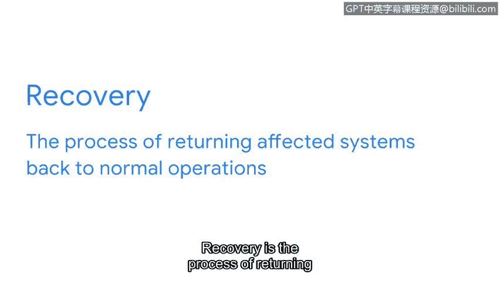

# 076：事件响应生命周期中的遏制、根除与恢复阶段

在本视频中，我们将讨论事件响应生命周期的第三阶段。这个阶段包含了安全团队如何**遏制**、**根除**事件并从事件中**恢复**的步骤。需要注意的是，这些步骤相互关联：遏制有助于实现根除的目标，而根除又有助于实现恢复的目标。此生命周期阶段也与NIST网络安全框架的核心功能——**响应**和**恢复**——相集成。

## 第一步：遏制

上一节我们介绍了事件检测，本节中我们来看看检测之后的关键步骤：遏制。在事件被检测到之后，必须对其进行遏制。

**遏制**是指限制和防止事件造成额外损害的行为。组织会在其事件响应计划中概述遏制策略。遏制策略详细说明了安全团队在检测到事件后应采取的行动。针对不同类型的事件，会使用不同的遏制策略。

以下是针对不同事件类型的遏制策略示例：
*   **针对单台计算机系统的恶意软件事件**：常见的遏制策略是通过断开网络连接来隔离受影响的系统。这可以防止恶意软件在网络中传播到其他系统。结果是，事件被控制在单一受感染系统内，从而限制了进一步的损害。

遏制行动是从环境中移除威胁的第一步。

## 第二步：根除

一旦事件得到遏制，安全团队便着手通过**根除**来移除事件的所有痕迹。根除涉及从所有受影响的系统中完全移除事件的构成元素。

以下是根除行动可能包括的步骤：
*   执行漏洞测试。
*   对与威胁相关的漏洞应用补丁。

## 第三步：恢复

事件响应生命周期本阶段的最后一步是**恢复**。恢复是将受影响的系统恢复到正常运营状态的过程。事件可能会在恢复期间中断关键的商业运营和服务。在恢复过程中，所有受事件影响的服务都将被恢复到正常运营状态。

以下是恢复行动可能包括的示例：
*   对受影响系统进行重镜像。
*   重置密码。
*   调整网络配置，例如防火墙规则。

需要记住的是，事件响应生命周期是循环的。随着时间的推移，可能会发生多起事件，并且这些事件可能相互关联。安全团队可能需要返回到生命周期中的其他阶段进行额外的调查。

本节课中我们一起学习了事件响应生命周期的第三阶段，涵盖了遏制、根除和恢复的核心步骤及其相互关系。接下来，我们将讨论生命周期的最后阶段。