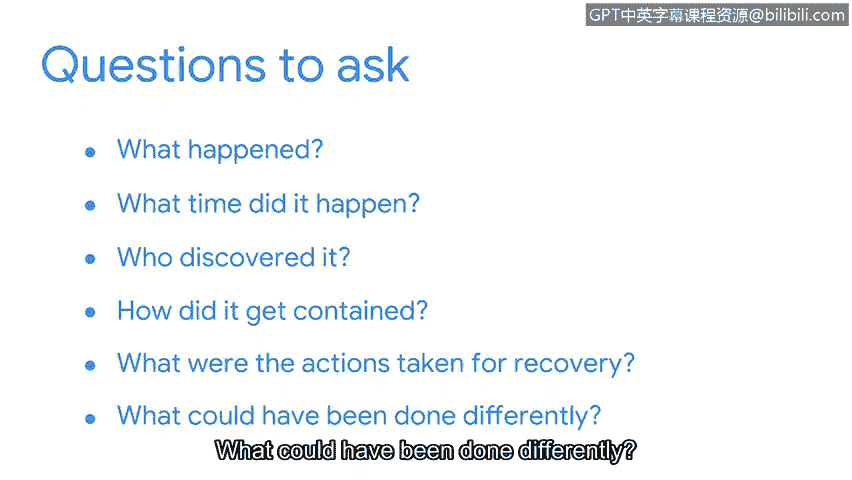

# 077：生命周期中的事后活动阶段

## 概述
在本节课中，我们将要学习事件响应生命周期的最后一个阶段——事后活动阶段。我们将了解安全团队在成功遏制、根除事件并从中恢复后，如何通过回顾与总结来改进未来的安全实践。

## 事后活动阶段介绍
上一节我们介绍了事件的遏制、根除与恢复。本节中我们来看看，当安全团队成功完成这些工作后，他们的任务是否就结束了？答案是否定的。无论是在面对新技术还是新漏洞时，安全领域总有更多需要学习的地方。而学习和改进的最佳时机，就发生在事件响应生命周期的最终阶段：**事后活动阶段**。

事后活动阶段包含了对事件进行回顾的过程，目的是找出在事件处理过程中可以改进的环节。

## 更新与创建文档
在此生命周期阶段，需要更新或创建不同类型的文档。其中一种需要创建的关键文档是**最终报告**。

最终报告是一份提供事件全面回顾的文档。它包含事件相关所有活动的时间线和详细信息，以及未来预防的建议。

## 从响应到预防的转变
在事件发生期间，安全团队的目标是集中精力进行响应和恢复。而在事件之后，安全团队的工作重点则转向最小化事件再次发生的风险。

改进流程的一种方法是召开**经验教训会议**。经验教训会议邀请所有参与事件处理的各方参加，通常在事件发生后两周内举行。在会议中，团队会回顾事件，以确定发生了什么、采取了哪些行动以及这些行动的效果如何。最终报告也作为本次会议的主要参考文件。

经验教训会议中讨论的目标，是分享关于事件的想法和信息，以及如何改进未来的响应工作。

以下是经验教训会议中可以提出的一些问题：
*   发生了什么？
*   它是什么时候发生的？
*   谁发现了它？
*   它是如何被遏制的？
*   为恢复采取了哪些行动？
*   本可以采取哪些不同的做法？

## 从错误中学习
事件回顾可能会揭示在检测前和响应过程中出现的人为错误。无论是安全分析师在恢复过程中遗漏了一个步骤，还是一名员工点击了钓鱼邮件中的链接导致恶意软件传播，都应避免因某人做了或没做某件事而对其进行指责。

相反，安全团队可以将其视为一个从已发生事件中学习并改进的机会。

## 总结
本节课中我们一起学习了事件响应生命周期的**事后活动阶段**。我们了解到，此阶段的核心是通过创建**最终报告**、召开**经验教训会议**来系统性地回顾事件，其目的不是追责，而是识别改进点、优化流程，从而提升组织未来的安全防御和响应能力。