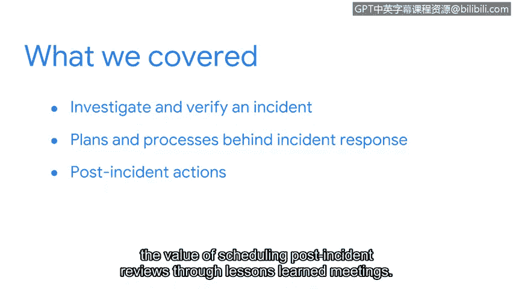

# 078：检测与响应

## 概述

在本节课中，我们将总结事件调查与响应的核心内容。我们将快速回顾NIST事件响应生命周期中的检测与分析阶段，以及后续的遏制、根除、恢复和事后行动阶段。作为安全分析师，理解这些流程至关重要。

---

## 章节回顾

上一节我们结束了关于事件调查与响应的讨论。现在，让我们快速回顾一下所学内容。

首先，我们重温了NIST事件响应生命周期中的**检测与分析**阶段，并重点探讨了如何调查和验证事件。

我们讨论了检测的目的，以及如何利用**入侵指标**来识别系统中的恶意活动。其核心概念是：通过监控特定模式或痕迹来发现异常。

**公式/代码示例：**
入侵指标可以是文件哈希、异常网络连接或特定的系统日志条目。

---

## 事件响应计划与流程

接下来，我们审视了事件响应背后的计划与流程，例如**文档记录**和**事件分级**。

以下是事件分级时通常考虑的几个关键因素：
*   影响范围：受影响的系统或用户数量。
*   严重性：对业务运营造成的损害程度。
*   紧急性：需要采取行动的速度。

---

## 遏制、根除与恢复

之后，我们探讨了**遏制**和**根除**事件的策略，以及如何从事件中**恢复**。

遏制旨在防止事件造成进一步损害，而根除则是彻底清除威胁源。恢复阶段则专注于使系统和业务操作恢复正常。

---

## 事后行动阶段

最后，我们研究了事件生命周期的最后一个阶段：**事后行动**。

我们讨论了最终报告、时间线的编制，以及通过“经验教训”会议进行事后审查的价值。这个过程对于改进未来的事件响应能力非常重要。

---

## 总结与展望

本节课中，我们一起学习了事件响应生命周期的各个阶段。作为安全分析师，你将负责完成生命周期每个阶段所涉及的一些流程。

接下来，你将学习关于**日志**的知识，并有机会在模拟环境中进行探索。