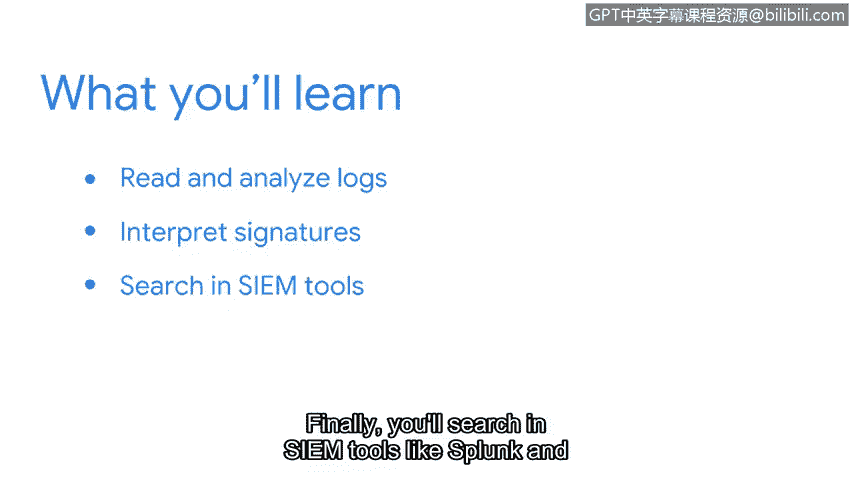

# 079：32_01_welcome-to-week-4

历史书籍、收据、日记。这些东西有什么共同点？它们都记录事件。

无论是历史事件、金融交易还是私人日记条目，记录都保存了事件的细节。获取这些细节能在许多方面帮助我们。

上一节中，我们探讨了事件响应生命周期每个阶段所涉及的不同流程和程序。本节中，我们将重点关注事件调查的关键组成部分之一：日志与警报。

在安全领域，日志记录事件细节，这些细节被用来支持调查。首先，你将全面了解日志，包括它们是什么以及如何生成。你还将学习如何阅读和分析日志。接着，你将重新审视入侵检测系统，探索如何解读签名。你将有机会通过使用名为Sracottta的工具进行实践活动来应用所学知识。最后，你将在Splunk和Chronicle等SIEM工具中搜索，以定位感兴趣的事件并访问日志数据。

事件是宝贵的数据源。它们有助于围绕警报创建上下文，使你能够解读系统上发生的操作。知道如何阅读、分析和关联不同事件，将帮助你识别恶意行为并保护系统免受攻击。

准备好，我们开始吧。