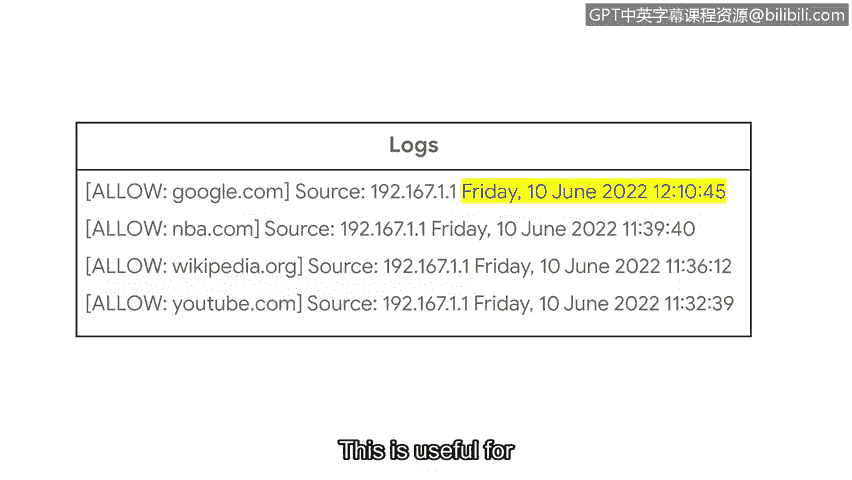

# 080：日志的重要性


在本节课程中，我们将学习网络安全中的基础概念——日志。我们将了解什么是日志、它们为何重要、如何被收集与分析，以及它们在安全监控和事件调查中的关键作用。通过学习，你将能够理解日志的基本结构，并初步掌握分析日志信息的方法。

## 什么是日志？📝

设备以事件的形式产生数据。作为回顾，事件是指在网络、系统或设备上发生的可观察到的活动。这些数据提供了对环境的可见性。日志是安全专业人员检测异常或恶意活动的关键方式之一。

**日志**是记录组织系统内发生事件的记录。系统活动被记录在所谓的**日志文件**中，通常简称为日志。几乎每个设备或系统都能生成日志。

## 日志的内容与价值 🔍

日志包含多个条目，详细描述了特定事件或发生情况的信息。日志对于安全分析师进行事件调查非常有用，因为它们记录了网络上事件发生的**内容**、**地点**和**时间**。

这些细节包括：
*   **日期**、**时间**、**位置**
*   执行的**操作**
*   执行操作的用户或系统的**名称**

这些细节不仅为排查系统性能相关问题提供了宝贵的见解，更重要的是，它们对于安全监控至关重要。日志允许分析师围绕各种事件构建故事和时间线，以准确理解发生了什么。

## 日志分析 📊

上一节我们介绍了日志的基本概念，本节中我们来看看如何利用这些日志。通过**日志分析**可以实现上述目标。**日志分析**是检查日志以识别感兴趣事件的过程。

由于获取日志的来源不同，且可能生成海量的日志数据，有选择性地记录日志有助于提高效率。例如，Web应用程序会生成大量的日志消息，但并非所有这些数据都与调查相关。事实上，无关数据甚至可能拖慢调查进度。排除特定数据不被记录，有助于减少搜索日志数据所花费的时间。

## 日志收集与处理：SIM工具的角色 ⚙️

你可能还记得我们关于SIM技术的讨论。SIM工具为安全专业人员提供了网络活动的高级概览。

SIM工具通过以下步骤实现这一功能：
1.  **收集**：首先从多个数据源收集数据。
2.  **聚合**：然后将数据聚合或集中到一个地方。
3.  **规范化**：最后，将不同的日志格式规范化或转换为单一的首选格式。

SIM工具有助于实时处理来自多个数据源的大量日志。这使得安全分析师能够快速搜索日志数据并执行日志分析，以支持他们的调查。

那么，日志是如何被收集的呢？被称为**日志转发器**的软件会从各种来源收集日志，并自动将它们转发到集中的日志存储库进行存储。

## 日志的数据来源 📡

由于不同类型的设备和系统都可以创建日志，因此环境中存在不同的日志数据源。这些来源包括：

以下是环境中常见的几种日志数据源：
*   **网络日志**：由代理、路由器、交换机和防火墙等设备生成。
*   **系统日志**：由操作系统生成。
*   **应用程序日志**：与软件应用程序相关的日志。
*   **安全日志**：由IDS或IPS等安全工具生成。
*   **认证日志**：记录登录尝试。

## 实战：分析一个网络日志示例 🧑‍💻

让我们来看一个来自路由器的网络日志示例。这里有几个日志条目，但我们将重点关注第一行。

```
action=allow source=192.0.2.1 destination=google.com timestamp=2023-10-27T14:30:00Z
```

我们可以观察到许多字段：
1.  **操作**：指定为 `allow`。这意味着路由器的防火墙设置允许从特定IP地址访问 `google.com`。
2.  **源**：列出了一个IP地址 `192.0.2.1`。
3.  **时间戳**：指定为 `2023-10-27T14:30:00Z`。这是日志中最重要的字段之一，我们可以识别操作发生的确切日期和时间。

到目前为止，这个日志条目的信息告诉我们：来自源IP地址 `192.0.2.1` 到 `google.com` 的网络流量是被允许的。时间戳对于关联多个事件以构建事件时间线非常有用。



就是这样。你已经分析了你的第一个网络日志。接下来，我们将继续讨论日志，并探索日志的格式。


## 总结 📝

本节课中我们一起学习了网络安全中日志的核心知识。我们明确了**日志**是系统事件的记录，是安全检测的基石。我们探讨了日志分析的价值，认识了**SIM工具**在收集、聚合和规范化海量日志数据中的关键作用。最后，我们通过一个实际的网络日志示例，拆解了其包含的**操作**、**源地址**和**时间戳**等关键字段，初步体验了如何从日志中提取信息。理解日志是进行有效安全监控和事件响应的第一步。