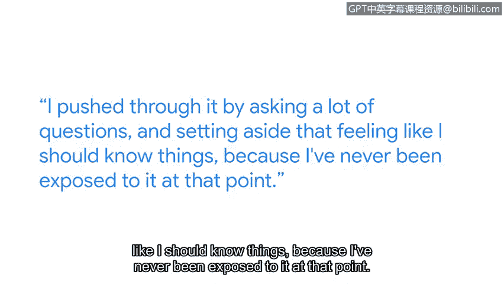

# 081：学习新工具与技术

## 概述
在本节课中，我们将跟随谷歌安全工程师Rebecca，了解她作为一名专注于身份管理的安全工程师的日常工作与学习经历。我们将探讨如何以攻击者的视角思考问题，并学习如何克服在接触全新且复杂的网络安全工具时可能产生的畏难情绪。

## 课程内容

我是Rebecca，是谷歌的一名安全工程师，我的工作重点是身份管理。

这份工作最棒的部分可能就是像攻击者一样思考。我非常喜欢这个环节：观察如何攻破系统，审视一个系统并思考，如果我是一个坏人，我会如何侵入它。

我会想要什么？我会寻找什么？我会如何找到凭证？我会如何找到有用的机器并成功登录？

我从事安全工作的第一天，我们就在学习一个新工具。整个组织都非常重视培训，他们说：“我们会让你直接上手，这是一个为期一周的学习网络分析器的培训。”

我当时对网络一无所知，更不用说网络安全或这个工具将用于什么。因此我感到压力巨大，因为我觉得自己像一个冒名顶替者，坐在本应属于别人的位置上，学习着远超我理解能力的东西。

我通过提出大量问题来推动自己前进，并放下了那种“我应该知道”的感觉，因为在那个阶段我从未接触过这些。**唯一的求知途径就是提问**。

这门课程包含许多工具，涵盖大量信息，很容易让人感到不知所措。事实上，我可能也会如此。这里有太多信息需要吸收。

我认为学习这样一门课程——它是一系列课程中的一部分——就像攀登一座高山。你已经爬到了很高的地方，空气变得稀薄，是的，这很困难。你感到不知所措，但你几乎就要登顶了。

## 总结
本节课中，我们一起学习了Rebecca作为安全工程师的视角。关键在于培养攻击者思维，并勇于在未知领域提问。学习过程如同登山，虽然越到高处越感艰难，但登顶后的视野将无比开阔。完成这些课程后，你的思维方式、看待事物的角度、你的能力以及寻找新工作或转换职业的潜力都将得到极大提升。