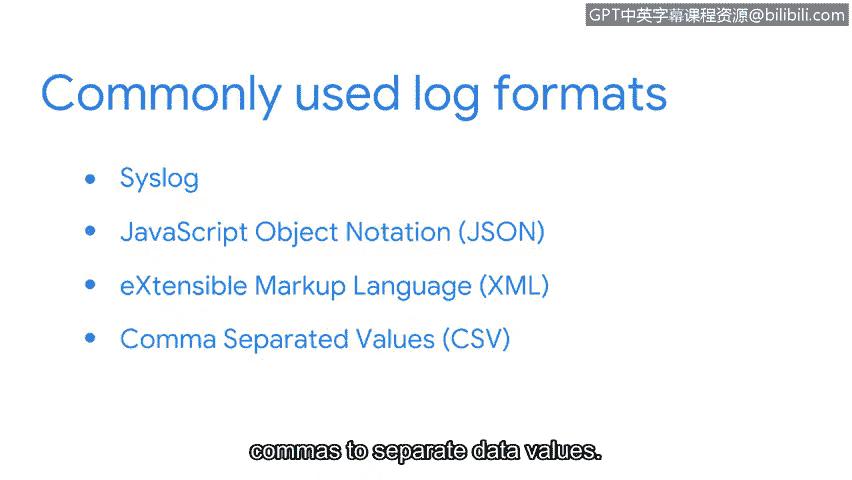

# 082：日志的多样性 📝


在本节课中，我们将要学习日志的不同格式。日志就像系统活动的“收据”，记录了网络中发生的各种事件。了解这些格式对于安全分析师解读日志、发现异常至关重要。

---

当你在商店购买商品时，通常会收到一张记录购买信息的收据。收据会分解交易信息，包含诸如日期、时间、收银员姓名、商品名称、价格和支付方式等细节。但并非所有商店的收据看起来都一样。例如，汽车维修发票在列出所售商品或服务时会使用大量细节。而餐厅的收据很可能不会包含如此多的细节。尽管商店收据之间存在差异，但所有收据都包含与交易相关的重要细节。

日志与收据类似。收据记录购买行为，而日志则记录在网络或系统上发生的事件或活动。作为一名安全分析师，你将负责解读日志。日志有不同的格式，因此并非所有日志看起来都一样，但它们通常包含诸如时间戳、系统特征（如IP地址）以及事件描述（包括采取的行动和执行者）等信息。

---

上一节我们了解了日志的基本概念，本节中我们来看看日志的多样性来源。我们知道，日志可以由许多不同的数据源生成，例如网络设备、操作系统等。这些日志源会生成不同格式的日志。有些日志格式被设计为人类可读的，而另一些则是机器可读的。有些日志可能非常详细，这意味着它们包含大量信息，而有些则简短明了。让我们探索一些常用的日志格式。

以下是几种常见的日志格式：

*   **Syslog**：这是最常用的日志格式之一。Syslog既是一种协议，也是一种日志格式。作为一种协议，它负责传输和写入日志；作为一种日志格式，它包含一个头部，后跟结构化数据和消息。一个Syslog条目包括三个部分：头部、结构化数据和消息。
    *   **头部**：包含时间戳、主机名、应用程序名称和消息ID等数据字段。
    *   **结构化数据**：包含以键值对形式组织的附加数据信息。例如，键 `eventSource` 可能对应值 `application`，指定了日志的数据源。
    *   **消息**：包含关于事件的详细日志消息。例如：`“User login failed”`。

*   **JSON (JavaScript Object Notation)**：这是一种基于文本的格式，设计目标是易于读写。它也使用键值对来组织数据。一个JSON日志示例如下：
    ```json
    {
      "alert": "malware",
      "timestamp": "2023-10-27T10:00:00Z",
      "source_ip": "192.168.1.100"
    }
    ```
    花括号 `{}` 表示对象的开始和结束。对象是括号之间的数据，使用键值对组织，每个键对应一个值，用冒号分隔。例如，第一行的键是 `alert`，值是 `malware`。JSON以其简单性和易读性而闻名。

*   **XML (Extensible Markup Language)**：这是一种用于存储和传输数据的语言和格式。它不使用键值对，而是使用标签和其他键来组织数据。一个XML日志条目示例如下：
    ```xml
    <logEntry>
      <firstName>John</firstName>
      <lastName>Doe</lastName>
      <employeeID>12345</employeeID>
      <dateJoined>2020-01-15</dateJoined>
    </logEntry>
    ```
    字段如 `firstName`、`lastName` 等被包含在标签中。

*   **CSV (Comma-Separated Values)**：这种格式使用分隔符（如逗号）来分隔数据值。一个CSV日志示例如下：
    ```
    timestamp,alert,source_ip,destination_ip
    2023-10-27T10:00:00Z,malware,192.168.1.100,10.0.0.1
    ```
    许多不同的数据字段（如时间戳、警报类型、源IP）用逗号分隔。

---



现在你已经了解了日志格式的多样性，接下来可以专注于评估日志，以便围绕检测构建上下文。在接下来的课程中，你将探索如何使用入侵检测系统（IDS）签名来检测、记录和警报可疑活动。

本节课中，我们一起学习了日志的多种常见格式，包括Syslog、JSON、XML和CSV。每种格式都有其特定的结构和用途，理解这些格式是安全分析师有效分析和响应安全事件的基础技能。