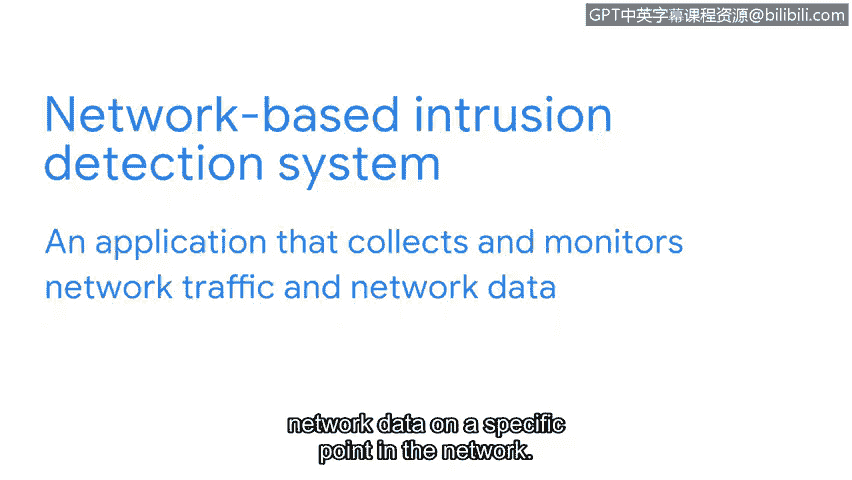

# 083：使用检测工具进行安全监控 🛡️

在本节课中，我们将学习检测技术如何监控设备和记录不同类型的系统活动数据，例如网络和端点遥测数据。理解这些概念是进行有效安全监控的基础。

检测需要数据，这些数据可以来自各种数据源。你已经探索了不同设备如何生成日志。现在，我们将研究不同的检测技术如何监控设备，并记录不同类型的系统活动，如网络和端点遥测数据。

遥测是为分析而进行的数据收集和传输，而日志记录的是系统上发生的事件。遥测描述的是数据本身。例如，数据包捕获被视为网络遥测数据。对于安全专业人员而言，日志和遥测数据都是证据来源，可用于在调查期间回答问题。

## 入侵检测系统回顾

之前，你学习了入侵检测系统（IDS）。请记住，IDS是一种监控活动并对可能的入侵发出警报的应用程序。这包括监控系统或网络的不同部分，例如端点。

端点是指连接到网络的任何设备，例如笔记本电脑、平板电脑、台式计算机或智能手机。端点是进入网络的入口点，这使其成为试图未经授权访问系统的恶意行为者的主要目标。

## 基于主机的入侵检测系统

为了监控端点是否存在威胁或攻击，可以使用基于主机的入侵检测系统。它是一种监控其安装所在主机活动的应用程序。需要澄清的是，主机是指网络上与其他设备通信的任何设备，类似于端点。

基于主机的入侵检测系统作为代理安装在单个主机上，例如笔记本电脑或服务器。根据其配置，它将监控其安装所在的主机，以检测可疑活动。一旦检测到某些情况，它会将输出记录为日志，并生成警报。

## 基于网络的入侵检测系统

如果我们想要监控网络呢？基于网络的入侵检测系统收集并分析网络流量和网络数据。基于网络的入侵检测系统的工作原理类似于数据包嗅探器，因为它们分析网络上特定点的网络流量和网络数据。

在网络的不同点部署多个IDS传感器以实现足够的可见性是很常见的。当检测到可疑或不寻常的网络活动时，基于网络的入侵检测系统会将其记录并生成警报。在此示例中，基于网络的入侵检测系统正在监控来自互联网和去往互联网的流量。

## 检测方法：特征分析

入侵检测系统使用不同类型的检测方法。最常见的方法之一是特征分析。

特征分析是一种用于发现感兴趣事件的检测方法。特征指定了一组规则，IDS在监控活动时会参考这些规则。如果活动与特征中的规则匹配，IDS会记录并发出警报。

例如，可以编写一个特征，以便在系统上连续发生三次登录失败时生成警报，这表明可能存在密码攻击。

## 日志记录与集中管理

在生成警报之前，必须记录活动。IDS技术将其监控的设备、系统和网络的信息记录为IDS日志。然后，这些IDS日志可以被发送、存储和分析在一个集中的日志存储库中，例如SIEM。

接下来，我们将探索如何读取和配置特征。我们将在那里与你见面。

---

在本节课中，我们一起学习了安全监控的核心检测工具。我们回顾了入侵检测系统（IDS）的概念，区分了基于主机和基于网络的IDS，并了解了它们如何通过特征分析等方法监控端点和网络活动。我们还认识到，所有这些检测活动产生的日志最终都需要被集中管理和分析，为后续的调查和响应奠定数据基础。