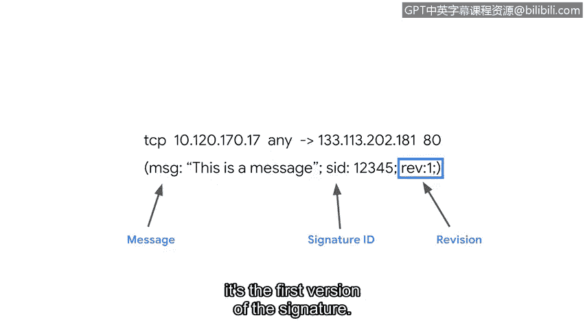

# 085：检测签名的构成要素 🔍


在本节课程中，我们将学习如何阅读和理解网络入侵检测系统（NIDS）中的检测签名。签名是定义检测规则的核心，掌握其构成对于安全分析师至关重要。

## 签名的作用与构成

作为安全分析师，您可能需要编写、定制或测试检测签名。为此，您将使用入侵检测系统工具。本节我们将研究签名的语法。学完本节后，您将能够阅读一个签名。

签名规定了检测规则。这些规则概述了您希望入侵检测系统检测的网络入侵类型。例如，可以编写一个签名来检测并告警试图连接到某个端口的可疑流量。

## 签名的三大组件

不同网络入侵检测系统的规则语言各不相同。网络入侵检测系统常缩写为NIDS。通常，NIDS规则由三个组件构成：动作、头部和规则选项。现在，让我们更详细地检查这三个组件。

### 1. 动作

动作通常是签名中指定的第一项。它决定了当满足规则匹配条件时要采取的行动。不同NIDS规则语言的动作可能不同，但一些常见的动作包括：`alert`（告警）、`pass`（放行）或`reject`（拒绝）。

使用我们的例子，如果一条规则指定要对建立异常端口连接的可疑网络流量发出告警，那么入侵检测系统将检查流量数据包并发出告警。

### 2. 头部

头部定义了签名所针对的网络流量。它包含诸如源和目的IP地址、源和目的端口、协议以及流量方向等信息。

如果我们想检测并告警连接到端口的可疑流量，我们必须首先在头部定义可疑流量的来源。可疑流量可能源自本地网络之外的IP地址，也可能使用特定或不寻常的协议。我们可以在头部指定这些外部IP地址和协议。

以下是一个基本规则中头部信息可能呈现的示例：

```
tcp 10.120.170.17 any -> 133.113.202.181 80
```

首先，我们可以观察到协议`tcp`是签名中列出的第一项。接下来，源IP地址`10.120.170.17`和源端口号被指定为`any`（任意）。签名中间的箭头`->`表示网络流量的方向。因此我们知道，流量源自源IP`10.120.170.17`的任意端口，去往目的IP地址`133.113.202.181`的目的端口`80`。

### 3. 规则选项

规则选项允许您使用附加参数自定义签名。有许多不同的选项可供使用。例如，您可以设置选项来匹配网络数据包的内容，以检测恶意负载。恶意负载驻留在数据包的数据部分，并执行删除或加密数据等恶意活动。

配置规则选项有助于缩小网络流量范围，从而精确找到您要查找的内容。典型的规则选项由分号分隔，并括在括号内。

在这个例子中，我们可以检查到规则选项被括在一对括号中，并且也用分号分隔：

```
(msg:"This is a message"; sid:1000001; rev:1;)
```

第一个规则选项`msg`（代表message）提供了告警文本。在本例中，告警将打印出文本“This is a message”。还有选项`sid`（代表Signature ID），它为每个签名附加一个唯一ID。`rev`选项代表修订版本。每次签名更新或更改时，修订号都会改变。这里的数字`1`表示这是该签名的第一个版本。

## 总结与展望



很好，现在您已经在成为安全分析师的旅程中掌握了另一项技能：如何阅读签名。还有更多知识需要学习。接下来，我们将讨论使用签名的工具。

---


本节课中，我们一起学习了网络入侵检测系统签名的核心构成。我们了解到一个完整的签名通常包含**动作**、**头部**和**规则选项**三部分。动作决定了匹配后的行为，头部定义了流量的五元组信息，而规则选项则提供了更精细的检测和描述能力。理解这些组件是编写、分析和调试安全检测规则的基础。