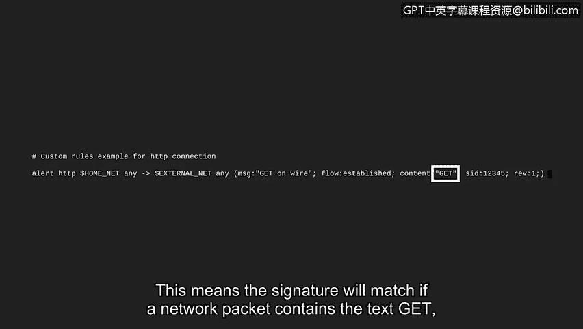

# 086：使用Suricata检查签名规则


## 概述
在本节课中，我们将学习如何使用开源的基于签名的入侵检测系统（IDS）——Suricata，来检查和分析一个预定义的签名规则。我们将了解签名规则的各个组成部分及其含义，并理解如何根据实际环境调整规则以提高检测效率。

---

## 回顾签名分析
上一节我们介绍了基于签名的分析方法，并学习了如何阅读基于网络的入侵检测系统（NIDS）中使用的签名。本节中，我们将通过一个具体的工具来实践这一知识。

## 探索Suricata签名文件
我们将使用一个名为Suricata的开源签名型IDS来检查一个签名规则。许多IDS技术都附带预写的签名，你可以将这些签名视为可自定义的模板，类似于文字处理器中提供的不同模板。这些签名模板为你编写和定义自己的规则提供了一个起点。当然，你也可以编写并添加自己的规则。

以下是通过Suricata检查预写签名的步骤：

1.  **定位配置文件目录**：在这台运行Ubuntu的Linux机器上，Suricata已经安装完毕。我们首先通过`cd`命令切换到`/etc`目录下的`suricata`目录。这里是所有Suricata配置文件的存放位置。
2.  **列出目录内容**：接下来，我们使用`ls`命令列出Suricata目录的内容。目录中有几个不同的文件，但我们将重点关注`rules`文件夹，预写的签名就存放在这里。你也可以在此处添加自定义签名。
3.  **进入规则文件夹**：我们使用`cd`命令，后跟文件夹名称，以导航到该文件夹。再次使用`ls`命令，可以观察到该文件夹包含针对不同协议和服务的规则模板文件。
4.  **查看规则文件**：让我们使用`less`命令来检查`custom.rules`文件。快速回顾一下，`less`命令会逐页返回文件内容，便于前后翻阅查看。

## 分析签名规则结构
我们将使用方向键向上滚动。以井号（`#`）开头的行是注释，旨在为阅读者提供上下文信息，Suricata会忽略这些行。

第一行注释写道：
```
# custom rules example for HTTP connection
```
这告诉我们，此文件包含针对HTTP连接的自定义规则。

我们可以观察到一个签名。签名的第一个词指定了该签名的**动作**。对于这个签名，动作是`alert`。这意味着当所有条件都满足时，该签名会生成一个警报。

签名的下一部分是**头部**。它指定了协议`http`、源IP地址`$HOME_NET`、源端口定义为`any`。箭头`->`指示了流量的方向：来自家庭网络（`$HOME_NET`），去往目的IP地址`$EXTERNAL_NET`和任意目的端口（`any`）。

到目前为止，我们知道这个签名在检测到任何离开家庭网络、前往外部网络的HTTP流量时会触发警报。

让我们检查签名的其余部分，以确定签名是否还有其他查找条件。

签名的最后一部分包含**规则选项**。它们被括在括号内，并用分号分隔。这里列出了许多选项，但我们将重点关注`msg`、`flow`和`content`选项。

*   `msg`选项将在警报触发时显示消息“GET on wire”。
*   `flow`选项用于匹配网络流量的方向。这里设置为`established`，表示连接已成功建立。
*   `content`选项检查数据包的内容。在引号之间，指定了文本`"GET"`。`GET`是一种HTTP请求方法，用于从服务器检索和请求数据。这意味着如果网络数据包包含文本`GET`（表示一个请求），该签名就会匹配。

**完整的签名规则示例**：
```suricata
alert http $HOME_NET any -> $EXTERNAL_NET any (msg:"GET on wire"; flow:established; content:"GET"; sid:1000001; rev:1;)
```

## 总结与安全分析师的角色
总而言之，当Suricata在从家庭网络发往外部网络的HTTP连接中观察到文本`GET`时，此签名就会发出警报。



每个环境都是不同的，为了使IDS有效，必须对签名进行测试和定制。作为安全分析师，你可能会测试、修改或创建IDS签名，以提高环境中威胁的检测能力，并减少误报的可能性。

接下来，我们将研究Suricata如何记录事件。我们稍后见。

---


## 本节课总结
本节课中，我们一起学习了如何定位和查看Suricata的签名规则文件，并深入分析了一个典型签名规则的各个组成部分，包括动作、头部和规则选项。我们理解了签名如何通过匹配特定条件（如协议、流量方向和内容）来触发警报，并认识到根据实际环境定制规则对于提高入侵检测系统效能的重要性。