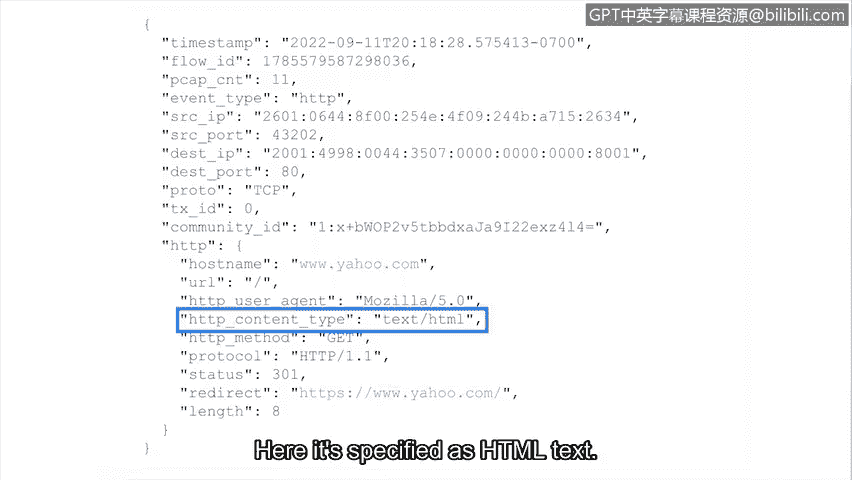

**网络安全检测与响应：第六课：分析Suricata日志**


在本节课程中，我们将学习如何分析由Suricata生成的日志。Suricata是一种网络入侵检测与防御系统，它通过生成详细的日志来记录网络活动和安全警报。理解这些日志的格式和内容是进行有效安全调查的关键。

---

上一节我们介绍了Suricata的基本概念，本节中我们来看看它生成的具体日志数据。

Suricata的警报和事件以一种称为Eve-JSON的格式输出。Eve代表“可扩展事件格式”，而JSON代表“JavaScript对象表示法”。正如之前所学，JSON使用**键值对**（例如 `{"key": "value"}`）来组织数据，这种结构简化了从日志文件中搜索和提取文本的过程。

Suricata主要生成两种类型的日志数据：**警报日志**和**网络遥测日志**。

以下是这两种日志类型的简要说明：

*   **警报日志**：包含与安全调查相关的信息。这通常是触发警报的签名（规则）的输出。例如，一个检测网络中可疑流量的签名会生成一个警报日志，捕获该流量的详细信息。
*   **网络遥测日志**：包含关于网络流量流的信息。网络遥测并非总是与安全直接相关，它只是记录网络上发生的事件，例如连接到特定端口。

这两种日志类型都为调查过程中构建事件脉络提供了信息。让我们来具体看看每种日志的示例。

---

首先，我们来看一个**警报日志**的示例。我们可以通过`event_type`字段的值为`alert`来判断这是一个警报事件。

```json
{
  "event_type": "alert",
  "src_ip": "192.168.1.100",
  "dest_ip": "10.0.0.5",
  "proto": "TCP",
  "alert": {
    "signature_id": 20001234,
    "signature": "ET MALWARE Suspicious User-Agent",
    "category": "A Network Trojan was detected"
  }
}
```

日志中还记录了被记录活动的详细信息，包括IP地址和使用的协议（如TCP）。此外，还有关于签名本身的细节，例如签名消息和ID。从签名消息判断，此警报似乎与检测到恶意软件有关。

---

接下来，我们看一个**网络遥测日志**的示例，它显示了对一个网站HTTP请求的详细信息。

```json
{
  "event_type": "http",
  "src_ip": "192.168.1.100",
  "dest_ip": "93.184.216.34",
  "hostname": "www.example.com",
  "http": {
    "http_user_agent": "Mozilla/5.0",
    "http_content_type": "text/html"
  }
}
```

`event_type`字段告诉我们这是一个HTTP日志。请求的详细信息包括：`hostname`（被访问的网站），`user_agent`（用于连接网站的软件名称，本例中是网页浏览器Mozilla 5.0），以及`content_type`（HTTP请求返回的数据类型，此处指定为HTML文本）。

---

以上就是对Suricata不同类型日志输出的分析。在接下来的实践活动中，你将通过亲手操作Suricata来应用我们刚刚探讨的知识。祝你学习愉快。



**总结**：本节课中，我们一起学习了Suricata生成的两种核心日志格式——警报日志和网络遥测日志。我们了解了Eve-JSON格式的结构，并通过具体示例分析了每种日志所包含的关键信息，这些信息对于追踪安全事件和理解网络活动至关重要。