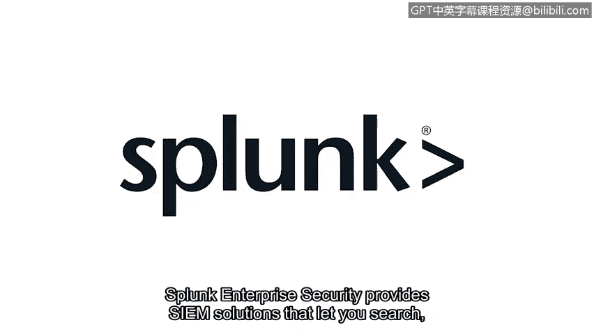

**网络安全基础：第六课：重新审视SIEM工具**

在本节课中，我们将学习安全信息与事件管理工具的核心功能与工作流程。SIEM工具是安全分析师进行日常监控、告警分析和事件调查的关键平台。

作为安全分析师，你需要能够快速访问履行职责所需的相关数据。无论是处理告警、监控系统，还是在事件调查中分析日志数据，SIEM都是完成这项工作的工具。简单回顾一下，SIEM是一种收集和分析日志数据以监控组织关键活动的应用程序。它通过收集、分析和报告来自多个来源的安全数据来实现这一目标。

之前，你已经了解了SIEM进行数据收集的过程。现在，让我们重新审视这个过程。

以下是SIEM处理数据的三个核心步骤：

1.  **数据收集**：SIEM工具从环境中各处的设备和系统收集并处理海量生成的数据。
2.  **数据规范化**：并非所有数据格式都相同。设备会生成不同格式的数据，这带来了挑战，因为没有统一的数据表示格式。SIEM工具通过**规范化**数据，使安全分析师能够轻松读取和分析。原始数据经过处理，格式变得一致，并且只包含相关的事件信息。
3.  **数据索引**：最后，SIEM工具对数据进行**索引**，以便可以通过搜索进行访问。所有不同来源的所有事件都可以通过指尖轻松访问。

这非常有用。SIEM工具使得快速访问和分析环境中网络上的数据流变得容易。作为安全分析师，你可能会遇到不同的SIEM工具。重要的是，你能够调整并适应你所在组织最终使用的任何工具。

考虑到这一点，让我们探索一些当前安全行业中使用的SIEM工具。

**Splunk**
Splunk是一个数据分析平台。Splunk Enterprise Security提供了SIEM解决方案，让你可以搜索、分析和可视化安全数据。首先，它从不同来源收集数据。然后，这些数据经过处理并存储在一个**索引**中。之后，可以通过多种不同方式访问它，例如通过搜索。

**Chronicle**
Chronicle是谷歌云的SIEM工具，它存储安全数据以供搜索、分析和可视化。首先，数据被转发到Chronicle。然后，这些数据被**规范化**或清理，以便于处理和索引。最后，数据变得可以通过搜索栏进行访问。

接下来，我们将探索如何在上述SIEM平台上进行搜索。

在本节课中，我们一起学习了SIEM工具的核心价值在于**收集、规范化、索引**安全数据，并了解了Splunk和Chronicle两款主流SIEM工具的基本数据处理流程。掌握这些工具的工作原理，是高效开展安全监控与分析工作的基础。