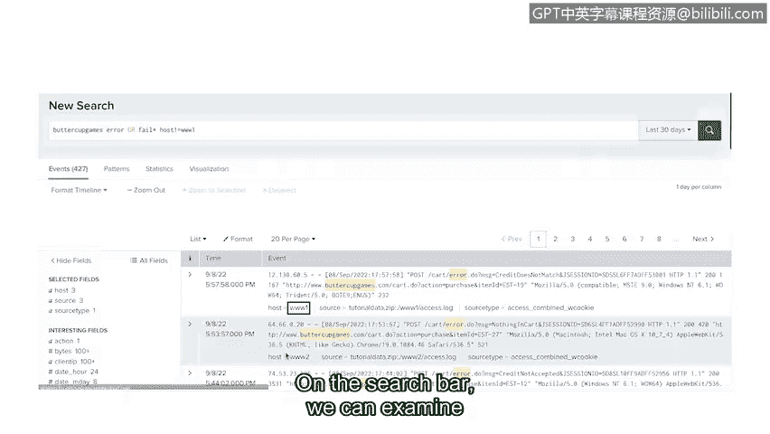

# 089：使用Splunk查询事件 🔍

在本节课中，我们将学习如何在安全信息与事件管理（SIEM）系统中进行搜索和查询，特别是使用Splunk的搜索处理语言（SPL）来检索和分析安全事件数据。

## 概述

上一节我们介绍了SIEM系统的工作原理。本节中，我们来看看如何查询已导入SIEM数据库的事件数据。用户可以通过在SIEM的搜索引擎中输入查询语句来访问这些数据。

SIEM数据库可以存储海量数据，其中一些数据可能追溯到多年前。这使得搜索特定安全事件变得具有挑战性。例如，假设您要搜索一个失败的登录事件。如果仅使用“failed login”这样的关键词进行搜索，这是一个非常宽泛的查询，可能会返回数千条结果。这类宽泛的查询会降低搜索引擎的响应速度，因为它需要在所有索引数据中进行搜索。

但是，如果您指定额外的参数，如事件ID、日期和时间范围，就可以缩小搜索范围，从而更快地获得结果。确保搜索查询足够具体非常重要，这样您才能精确找到所需内容，并节省搜索过程的时间。

## 在Splunk中进行查询

不同的SIEM工具使用不同的搜索方法。例如，Splunk使用其专有的查询语言，称为搜索处理语言，简称SPL。SPL提供多种搜索选项，可用于优化搜索结果，从而获取您需要的数据。

现在，我将演示在Splunk Cloud中对一个名为Buttercup Games的虚构在线商店，进行涉及错误或失败事件的原始日志搜索。

以下是执行搜索的基本步骤：

1.  **构建查询语句**：首先，我们在搜索栏中输入查询语句：`Buttercup Games error OR fail*`。
    *   此查询指定了索引为“Buttercup Games”。
    *   同时指定了搜索词“error”或“fail”。
    *   布尔运算符`OR`确保两个关键词都会被搜索。
    *   术语`fail*`末尾的星号`*`是一个通配符，意味着它将搜索所有包含“fail”的可能结尾。这有助于扩展搜索结果，因为事件可能以不同方式标记失败，例如使用“failed”一词。

2.  **选择时间范围**：接下来，我们使用时间范围选择器指定一个时间段。请记住，搜索越具体越好。让我们搜索过去30天的数据。

3.  **分析搜索结果**：在搜索栏下方，我们可以看到搜索结果。
    *   **时间线**：提供了一个时间段内事件数量的可视化图表，有助于识别事件模式，例如活动高峰。
    *   **事件查看器**：列出了所有匹配搜索的事件。请注意，我们的搜索词“Buttercup Games”和“error”在每个事件中都被高亮显示。似乎没有找到与“fail”一词匹配的事件。
    *   **事件详情**：每个事件都带有时间戳和包含错误的原始日志数据。数据显示，Buttercup Games网站上使用的HTTP cookie存在相关错误。
    *   **数据源信息**：在原始日志数据的底部，有一些与数据源相关的信息，包括主机名、来源和来源类型。这些信息告诉我们事件数据源自何处，例如某个设备或文件。

## 优化搜索结果

如果我们点击数据源信息（例如主机名WWW1），可以选择将其从搜索结果中排除。

在搜索栏中，我们可以看到搜索词已更改为包含`host!=WWW1`，这意味着不包含WWW1主机。请注意，新的搜索结果中不包含WWW1作为主机，但包含WWW2和WWW3。这只是您可以用来定位搜索以检索所需信息的众多方法之一。

这种搜索称为原始日志搜索，由于它在搜索过程中提取日志数据字段，因此搜索性能较慢。作为安全分析师，您将使用不同的SPL命令来优化搜索性能，以获得更快的搜索结果。

## 总结

本节课中，我们一起学习了在Splunk中进行查询。您了解了有效查询的重要性，并掌握了执行基本Splunk搜索的方法。接下来，您将学习如何在Chronicle中查询事件。