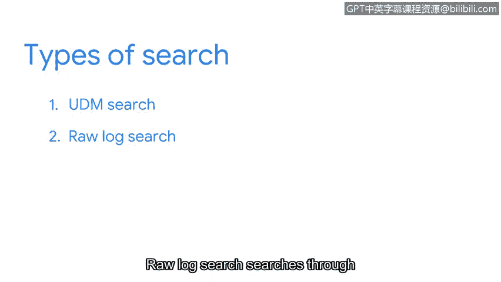
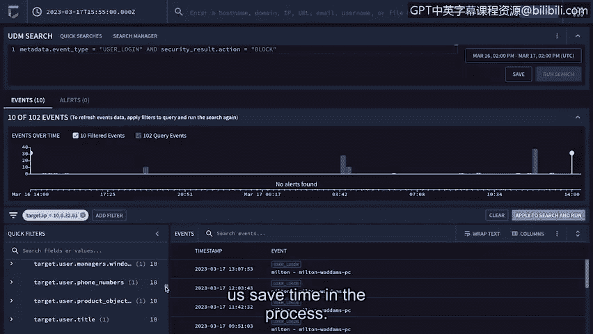

# 090：使用Chronicle查询事件

在本节中，我们将学习如何使用Chronicle平台来搜索和筛选日志数据。Chronicle是谷歌云的安全分析平台，它允许安全分析师高效地查询事件，以进行威胁检测和调查。我们将重点介绍其搜索功能，包括如何使用统一数据模型搜索和原始日志搜索。

## 概述：Chronicle搜索基础

Chronicle允许你搜索和筛选日志数据。在本视频中，我们将探索使用Chronicle的搜索字段来定位特定事件。

Chronicle使用**YARA-L**语言来定义检测规则。这是一种用于创建规则以搜索已摄入日志数据的计算机语言。例如，你可以使用YARA-L编写规则来检测与有价值数据外泄相关的特定活动。

使用Chronicle的搜索字段，你可以搜索诸如主机名、域名、IP地址、URL、电子邮件、用户名或文件哈希等字段。

## 搜索类型：UDM搜索与原始日志搜索

使用搜索字段时，你可以输入不同类型的搜索。默认的搜索方法是使用**UDM搜索**，它代表统一数据模型。这种搜索会遍历经过规范化的数据。

如果你在规范化数据中找不到所需的数据，你还可以选择搜索**原始日志**。原始日志搜索会遍历尚未被规范化的日志。

从我们之前关于SIEM流程的讨论中，你可能还记得，原始日志会在规范化步骤中被处理。在规范化过程中，原始日志中的所有相关信息会被提取并格式化，使数据更易于搜索。我们可能需要搜索原始日志的一个原因是，查找可能未包含在规范化日志中的数据，例如尚未被规范化的特定字段，或者用于排查数据摄入问题。

## 实践：执行一次UDM搜索

现在，让我们通过一个例子来检查如何使用Chronicle进行失败登录的UDM搜索。

首先，点击结构化查询构建器图标，以便我们可以执行UDM搜索。

我将输入搜索条件：`metadata.event_type = “USER_LOGIN” AND security_result.action = “BLOCK”`。

让我们分解这个UDM搜索。由于我们正在搜索规范化数据，我们需要指定一个使用UDM格式的搜索。UDM事件具有一组通用字段。

*   `metadata.event_type`字段详细说明了事件的类型。在这里，我们要求Chronicle查找一个认证活动事件，即“用户登录”。
*   `AND`是一个逻辑运算符，它告诉搜索引擎要同时包含这两个条件。
*   最后，`security_result.action`字段指定了一个安全操作，例如“允许”或“阻止”。在这里，操作是“阻止”。这意味着用户登录被阻止或失败了。

现在，我们按下查询按钮。我们将专注于搜索规范化数据。

## 解读搜索结果

我们看到了一个显示搜索结果的屏幕。这里有很多信息。

在“UDM搜索”下，我们可以看到我们的搜索条件。

还有一个条形图时间线，可视化显示了一段时间内的失败登录事件。快速浏览一下，这让我们可以了解失败登录活动随时间的变化情况，从而发现可能的模式。

在时间线下方，有一个与此搜索关联的带时间戳的事件列表。

在每个事件下，都有一个资产，即设备名称。例如，这个事件显示了一个名为“Alice”的用户的失败登录。如果我们点击该事件，可以打开与该事件关联的原始日志。在调查过程中，我们可以解读这些原始日志以获取有关事件活动的更多细节。

在左侧，有快速过滤器。这些是我们可以用来筛选搜索结果的附加字段或值。例如，如果我们点击`target.ip`，会得到一个IP地址列表。如果我们点击其中一个IP地址，就可以将搜索结果筛选为仅包含此目标IP地址。这有助于我们找到正在寻找的特定数据，并在此过程中节省时间。

## 总结

做得好。现在，你知道了如何使用Chronicle执行搜索。在接下来的实践活动中，你将有机会使用我们刚刚讨论过的SIEM工具来执行搜索。😊