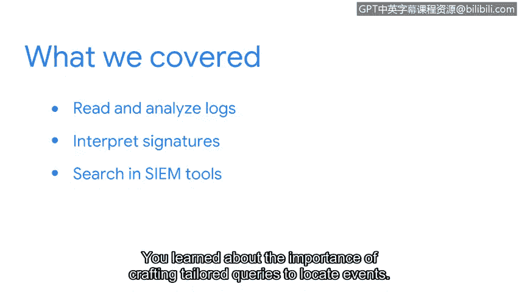

# 091：检测与响应总结 🎯

在本节课中，我们将回顾并总结关于日志分析、入侵检测系统以及安全信息与事件管理工具的核心知识与技能。

## 章节回顾 📚

恭喜你完成了本部分的学习。在你的安全学习之旅中，你已经取得了巨大的进步。让我们回顾一下所学内容。

上一节我们介绍了日志分析的基础，本节中我们来总结关键要点。

以下是本部分的核心学习内容总结：

*   **日志分析与解读**：你学习了如何阅读和分析日志。你研究了日志文件的生成方式及其在分析中的应用。
*   **日志格式比较**：你比较了不同类型的常见日志格式，并学会了如何解读它们。
*   **入侵检测系统深化**：通过比较**基于网络的入侵检测系统**和**基于主机的入侵检测系统**，你扩展了对入侵检测系统的理解。
*   **签名解读与编写**：你学习了如何解读**签名**。你研究了签名的编写方式，以及它们如何检测、记录和告警入侵行为。
*   **命令行工具实践**：你在命令行中与 **`serrakata`** 工具交互，以检查和解读签名与警报。
*   **SIEM工具搜索**：最后，你学习了如何在如 **`Splunk`** 和 **`Chronicle`** 这类SIEM工具中进行搜索。你认识到了构建针对性查询以定位安全事件的重要性。

## 技能应用与重要性 ⚙️

在事件响应的最前沿，监控和分析网络流量以寻找入侵指标是主要目标之一。能够执行深入的日志分析、知道如何阅读和编写签名以及如何访问日志数据，这些都是你作为安全分析师将要用到的技能。

## 课程总结 🏁

本节课中，我们一起学习了网络安全检测与响应的核心组成部分。从基础的日志分析到入侵检测系统的原理，再到使用专业工具进行实践，你已建立起识别和应对安全威胁的重要知识框架。这些技能是构建有效安全防御体系的基础。