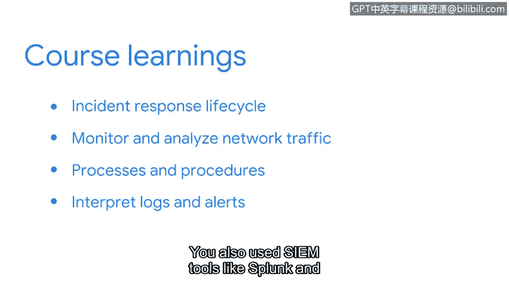

# 092：课程总结

在本节课中，我们将回顾《检测与响应》课程的核心内容。我们将总结在事件响应生命周期、网络流量分析、日志解读以及安全分析师日常工作中所学习的关键概念与工具。

## 课程内容回顾

首先，我们从事件响应生命周期的概述开始。你学习了安全团队如何协调响应工作，并探索了事件响应中使用的文档、检测和管理工具。

接下来，我们学习了如何监控和分析网络流量。你了解了使用数据包嗅探器（Packet Sniffers）捕获和分析数据包。你还练习使用了像 **`tcpdump`** 这样的工具来捕获和分析网络数据，以识别入侵指标（IOCs）。

上一节我们介绍了网络分析，本节中我们来看看事件响应的具体流程。我们探讨了事件响应生命周期各阶段涉及的流程和程序。你学习了与事件检测和分析相关的技术。你还了解了诸如监管链（Chain of Custody）、预案手册（Playbooks）和最终报告（Final Reports）等文档。最后，我们以探索用于恢复和事后活动的策略作为结束。

最后，我们学习了如何解读日志和警报。你探索了在命令行中使用 **Suricata** 来阅读和理解签名与规则。你还使用了像 **Splunk** 和 **Chronicle** 这样的安全信息与事件管理（SIEM）工具来搜索事件和日志。

## 安全分析师的职责与展望

作为一名安全分析师，你每天都将面临新的挑战。无论是调查证据还是记录你的工作，你都将运用在本课程中学到的知识来有效地响应事件。

你在扩展知识面和学习新工具以充实你的安全工具箱方面做得非常出色。安全领域最吸引人的一点在于总有新知识可以学习。在接下来的课程中，你将通过探索一种名为 **Python** 的编程语言来继续你的学习之旅，该语言可用于自动化安全任务。

本节课中我们一起学习了事件响应的完整生命周期、网络流量分析工具（如 `tcpdump`）、日志分析工具（如 Suricata 和 SIEM 平台）以及安全分析师的核心工作流程。请继续保持出色的学习状态。