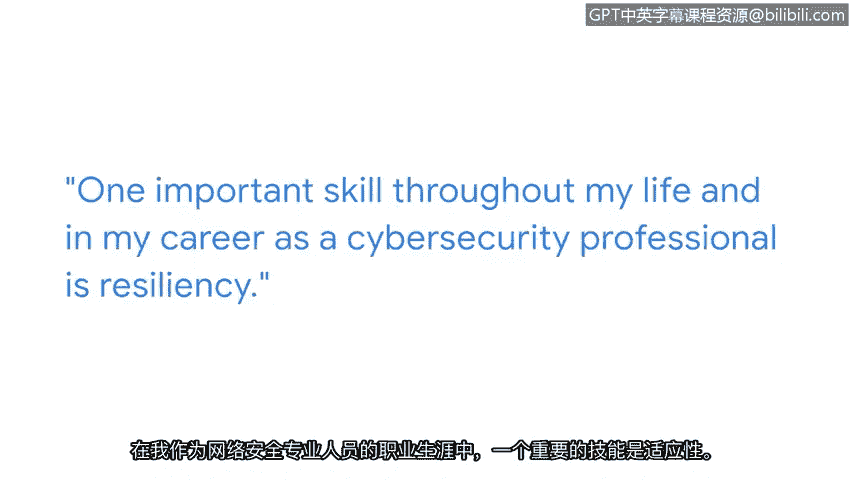

# 002：安吉尔的个人职业之旅 🚀

在本节课中，我们将跟随谷歌安全工程师安吉尔（Zanghi）的分享，了解他如何从童年好奇心成长为一名专业网络安全工程师的个人职业旅程。他的经历揭示了进入网络安全领域的关键动力、所需技能以及持续学习的重要性。

## 从好奇心到技术之路

我的名字是安吉尔，是谷歌的一名安全工程师。

我人生中的许多经历将我引向了安全领域。

其中之一无疑是我成长过程中的好奇心。

我的父母是会计师，所以他们有袖珍计算器、机械铅笔和钢笔。

我总是把它们拆开，取出零件，试图弄清楚它们的工作原理。

这让我对广义上的技术产生了兴趣。

同样的概念再次得到应用，即试图弄清楚事物如何运作并“破坏”它们。

这基本上就是安全领域试图做的事情：通过“破坏”事物来弄清楚是否有人能在你之前破坏它们。

## 职业起点与转型动机

我的职业生涯始于网络工程师。

这份工作是为不同的公司设置防火墙、交换机和路由器。

我想加入网络安全领域，主要是因为我被行业内发生的事情深深激励，例如“极光行动”——谷歌被外国行为者黑客攻击的事件。

当时我阅读相关报道，并心想，我希望能与那些在前线处理这些问题的人们一起工作。

## 主动学习与技能提升

当我开始进入网络安全领域，并希望实现职业跳跃时，我明确了我想学习什么以及我需要达到什么水平。

一个例子是通过Python学习自动化。

我参加了在线课程。

我完成了认证，特别是非常流行的安全认证。

然后，我开始将其中一些方面融入到我当时的工作中。

## 适应变化与持续学习

当我从墨西哥搬到美国工作时，我不得不学会如何保持灵活。

你必须学习新事物才能推动职业发展。

有时，你甚至需要学习新事物，只是为了保持在原地。

在安全领域，我认为在整个技术行业都是如此，但尤其是在网络安全领域，你必须不断地重塑自我，持续学习事物如何运作，以及你如何能帮助这个行业。

## 关键技能：韧性

在我的一生以及作为网络安全专业人士的职业生涯中，一项重要的技能是韧性。

当我第一次搬到美国时，我对韧性有了深刻的理解。

事情的发展并未如我所愿。

我必须不断尝试新事物。

并抱最好的希望。

这与我们作为安全专业人士的日常工作并无不同。

我们每天都在做这样的事情。

我们必须找到让事情运转的方法。

我们必须找到让项目按我们需要的方式运行的方法。

或者我们必须找到解决问题的方法。

## 行业需要多元化人才

网络安全领域需要更多具有不同背景的专业人士。

这意味着不同的经验、看待事物的不同方式、以及处理和解决问题的不同方法。

我们这个行业需要更多像你一样的人。

---

**本节课总结**

本节课中，我们一起学习了安全工程师安吉尔的职业旅程。他从童年拆解物品的好奇心出发，经历了网络工程师的起点，因行业事件激励而转型网络安全，并通过主动学习Python自动化等技能成功转型。他的经历强调了在快速变化的技术领域，**保持好奇心、主动学习新技能（如 `Python` 自动化）、培养韧性以及拥抱多元化背景**对于网络安全职业发展的重要性。他的故事鼓励所有初学者，不同的视角和经验正是这个行业所急需的。