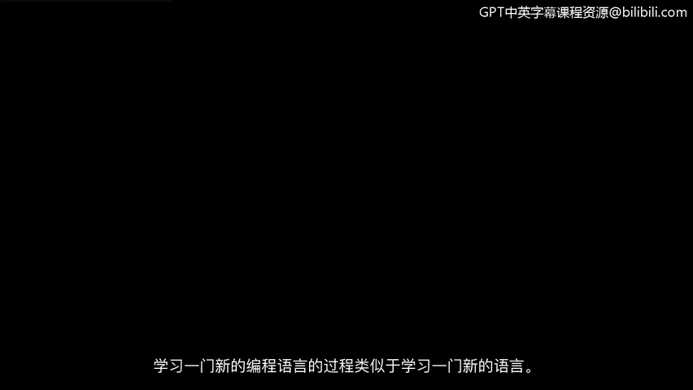
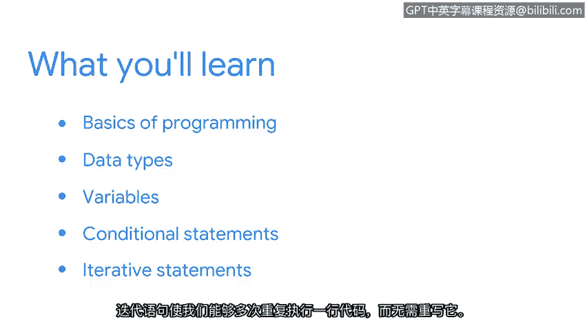

# 003：欢迎来到第一周




在本节课中，我们将开始学习Python编程语言的基础知识。我们将了解编程的基本概念、Python的数据类型、变量以及如何编写条件语句和循环语句。这些是构建自动化脚本以执行网络安全任务的核心基石。

学习一门新的编程语言类似于学习一门新的人类语言。编程语言由单词组成。这些单词被组织在一起，形成代码行。代码行用于与计算机通信，类似于句子。代码行告诉计算机如何执行一项任务。

在本节中，我们将开始学习与计算机通信所需的语言，同时探索Python的一些关键组成部分。

## 为什么学习Python

我们将从介绍编程的基础知识开始，首先探讨为什么安全分析师会使用Python。

学习Python帮助我在职业生涯中取得成功，因为使用Python使我能够从重复性任务中解放时间，转而专注于更具挑战性的任务和问题。成功应用自动化可以减少我的整体工作量，提高生产力，并降低人为错误的风险。自动化的使用也使我能够专注于需要更多创造力、协作和解决问题的工程任务。

## Python编程基础

接下来，我们将开始构建Python的基础。我们将讨论数据类型，然后介绍变量。最后，我们将学习可以在Python中编写的特定语句，例如条件语句。

以下是Python中的基本数据类型：
*   **字符串**：用于表示文本，例如 `"Hello, World!"`。
*   **整数**：用于表示没有小数部分的数字，例如 `42`。
*   **浮点数**：用于表示有小数部分的数字，例如 `3.14`。
*   **布尔值**：用于表示逻辑真或假，即 `True` 或 `False`。

变量是用于存储数据的容器。你可以这样给变量赋值：
```python
username = "admin"
login_attempts = 3
is_logged_in = False
```



## 控制程序流程的语句

条件语句帮助我们为程序加入逻辑。它们允许程序根据特定条件做出决策。

我们将要学习的第二种语句是迭代语句。迭代语句允许我们多次重复一行代码，而无需重写它。例如，`for` 循环可以遍历一个列表：
```python
for ip in suspicious_ips:
    print(f"Checking IP: {ip}")
```

你准备好开始用Python编程了吗？让我们开始吧。


## 总结


本节课中，我们一起学习了Python编程的入门知识。我们了解了学习Python对网络安全工作的重要性，它能够通过自动化提升效率和准确性。我们初步认识了编程的基本元素，如数据类型、变量，并简单接触了控制程序流程的条件语句和循环语句。这些概念是后续编写自动化脚本的基础。