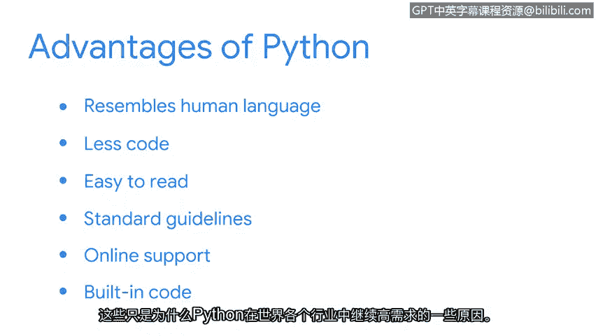

# 004：Python与网络安全

在本节课中，我们将要学习编程在网络安全领域的应用，特别是Python语言如何帮助安全专业人员自动化日常任务，从而提高工作效率和准确性。

## 什么是编程？🤔

上一节我们介绍了安全专业人员使用的各种工具。本节中我们来看看其中一种核心工具：计算机编程。

编程是为计算机创建一套特定指令以执行任务的过程。我们可以通过一个自动售货机的例子来理解它。

将自动售货机想象成一台为顾客提供食物或饮料的计算机。为了获得商品，顾客需要向机器投入钱币，然后选择他们想要的商品。

假设顾客向机器提供了5美元。机器会存储这个数值，同时顾客进行选择。如果顾客选择了一个价值2美元的糖果棒，机器会接收这个输入（也称为指令），然后理解并输出价值2美元的糖果棒，并找回3美元零钱。

## 为什么选择Python？🐍

世界上存在许多编程语言。这里我们将重点介绍Python。

Python被认为是一种通用语言。这意味着它可以创建各种不同的程序，并且不专门针对任何特定问题。在Web开发和人工智能等领域，Python通常用于构建网站和进行数据分析。

在安全领域，我们使用Python的主要原因是**自动化我们的任务**。

**自动化**是指利用技术来减少执行常见和重复任务所需的人工和手动劳动。Python通常最适合自动化简短、简单的任务。

以下是Python在安全领域的一些应用示例：

*   **日志分析**：处理安全事件的分析师可能有一个包含必要信息的日志。手动阅读这些信息会花费太多时间，但Python可以帮助筛选，让分析师快速找到所需内容。
*   **访问控制列表管理**：分析师可以使用Python来管理访问控制列表（即控制谁可以访问系统及其资源的列表）。如果每次有员工离职，分析师都必须手动移除其访问权限，这可能会降低一致性。然而，一个Python程序可以定期监控并自动执行此操作。
*   **网络流量分析**：Python也可以执行一些自动化任务，如分析网络流量。虽然这些任务可以通过外部应用程序完成，但使用Python同样可以实现。

## Python的优势 ✨

除了自动化单个任务，Python还可以将单独的任务组合成一个工作流。例如，想象一个操作手册指示分析师需要通过删除文件然后通知相关人员来解决某种情况。Python可以将这些流程连接在一起。

那么，安全专业人员究竟为何选择Python来完成这些任务呢？Python作为一种编程语言具有以下几个优势：

以下是Python的主要优势：

1.  **用户友好**：Python类似于人类语言，需要的代码更少，且易于阅读。
2.  **代码规范**：Python程序员遵循标准指南（如PEP 8），这确保了代码设计和可读性的一致性。
3.  **丰富的社区支持**：学习Python的另一个重要原因是拥有大量的在线支持社区和资源。
4.  **强大的标准库和第三方库**：Python拥有一个广泛的基础代码库（标准库）和第三方库，我们可以导入并使用它们来执行许多不同的任务。

这些只是Python在全球不同行业中持续保持高需求的部分原因。在你的安全职业生涯中，你很可能会用到它。

本节中我们一起学习了编程的基本概念，了解了Python语言在网络安全自动化任务中的核心作用及其主要优势。接下来，我们将短暂休息，然后在下一个视频中正式开始运行一些Python代码。