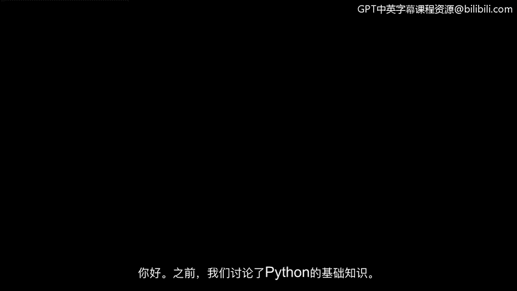
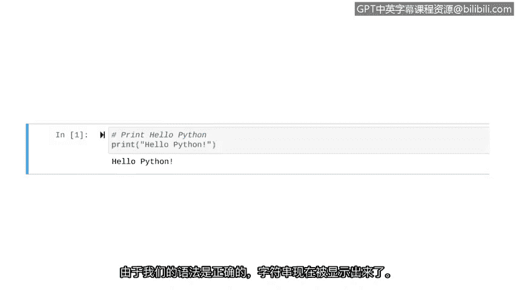
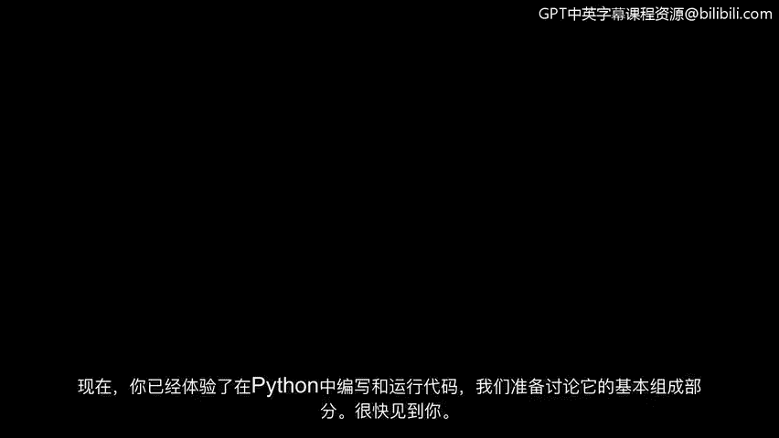

# 005：创建一个基本的Python脚本 🐍



在本节课中，我们将学习如何编写并运行一个基础的Python脚本。我们将从理解脚本与程序的区别开始，然后动手创建一个包含注释和打印功能的简单脚本，并最终运行它。

---

上一节我们介绍了Python的基础知识。本节中，我们将练习编写和运行代码。

在Python中，我们编写的代码被称为脚本或程序。两者之间存在细微差别。我们可以将计算机程序比作一场戏剧表演。

几乎每场戏剧表演都有一份书面剧本。演员们学习和记忆剧本，以便向观众念出台词。然而，这并非表演的全部。整个表演还包括导演对灯光、服装和舞台布景等做出的决策。整个表演涉及许多设计选择，如场景设计、灯光和服装。

创建这个作品的过程类似于Python编程的过程。编程涉及许多设计决策。但在Python中编写脚本的过程，更像是撰写演员将要念出的具体台词。

---

在Python中，良好的实践是从一个注释开始。注释是程序员为说明代码意图所做的笔记。现在让我们添加一个。

我们以井号 `#` 开始，表明这是一行注释，然后添加关于我们意图的细节。在这里，我们打算在屏幕上打印“hello Python”。

```python
# 在屏幕上打印“hello Python”
```

---

现在，让我们编写第一行Python代码。这段代码使用 `print` 函数。`print` 函数将指定的对象输出到屏幕。在 `print` 之后，我们将要输出的内容放在括号内。在本例中，我们想输出字符串“hello Python”。我们必须将字符串数据放在引号中。

```python
print("hello Python")
```

这些引号只是你在Python中会遇到的一种语法示例。语法指的是决定计算语言中正确结构的规则。

---

现在，我们将运行这段代码，以便计算机能够输出这个字符串。

运行代码后，由于我们的语法正确，字符串现在被显示出来。你刚刚运行了你的第一行代码。



---



现在你已经体验了在Python中编写和运行代码，我们已准备好讨论其基本组件。下节课见。