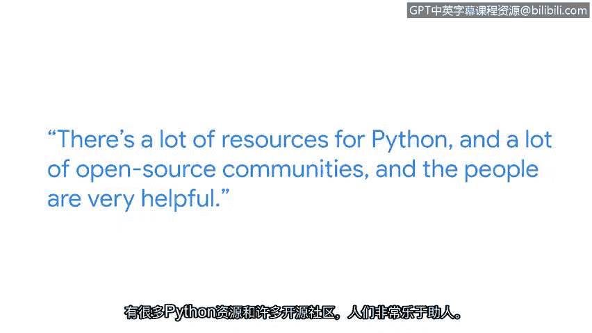

# 006：Python与网络安全专业人员 👨‍💻

## 概述
在本节课程中，我们将跟随谷歌安全工程师阿卡什的分享，了解Python编程语言在网络安全领域的核心价值与应用场景。我们将探讨为什么Python是网络安全专业人员的必备技能，以及如何开始学习并利用它来应对实际工作中的挑战。

---

我叫阿卡什，是谷歌的一名安全工程师。作为一名网络安全工程师，在你的职业生涯中，大部分时间都会用到Python。

当你进入网络安全领域时，学习Python非常重要。你将处理数以百万计的数据点，手动处理这些数据会非常困难。这时，Python就能发挥作用，通过自动化和编写脚本或小程序，在瞬间完成同样的工作。

当你看到大约10行代码就能在几秒钟内处理数兆字节的数据时，学习Python会变得非常有趣且充满成就感。

Python拥有丰富的学习资源和活跃的开源社区，社区成员也非常乐于助人。保持好奇心，尝试解决一些小问题，并亲自动手实践。不要害怕查阅语法，要善于利用在线资源进行学习。

---

上一节我们了解了Python在网络安全中的重要性，接下来我们看看阿卡什在谷歌的具体工作内容。

作为谷歌Chrome团队的安全工程师，我的工作是保护我们的客户免受外国政府以及世界各地持续威胁的攻击。

威胁是无限的，没有边界，这也正是网络安全领域令人兴奋的地方。

---

因此，请坚持下去。Python是一项必备技能，初期可能需要一些时间来掌握，但它将在你的整个职业生涯中持续发挥作用。

---

## 总结
本节课中，我们一起学习了网络安全工程师阿卡什的观点。我们了解到，Python是处理海量安全数据、实现任务自动化的关键工具，能极大提升工作效率。学习Python的过程充满乐趣和成就感，并且有丰富的社区资源支持。面对无限的网络安全威胁，掌握Python这项核心技能，对于构建长久的职业生涯至关重要。